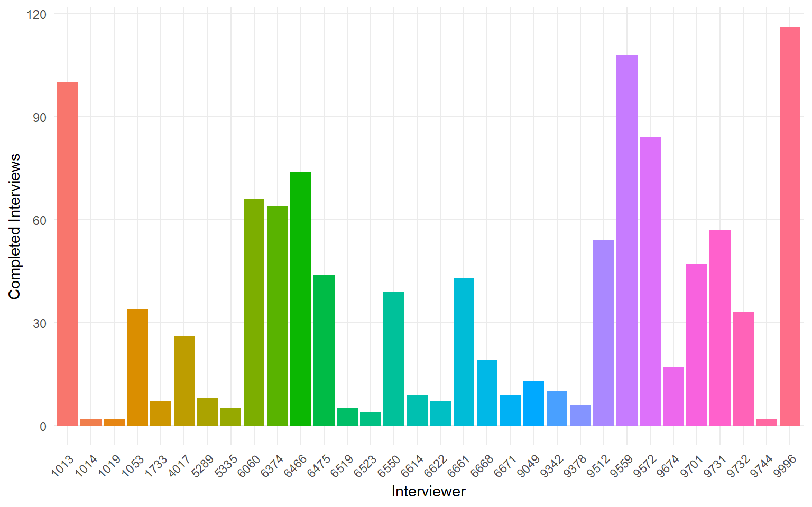
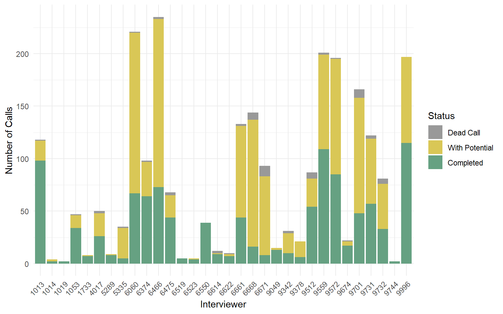

# **Summary**
<div style="text-align: center; font-weight: bold; font-size: 30px;">
Summary Status
</div>
<div style="text-align: center; font-style: italic; font-size: 16px;">
This page shows the HHIDs whose number of calls are/close to the 15 call replacement threshold. This also shows which HHIDs whose completes are more than 1. This also shows which PSUs still have 0 output.
</div>


::: {.row}
::: {.column width="85%" .mx-auto}
::: {.card}
## **Incomplete HHIDs for Replacement** <i>(at least 15 calls and not complete, days not incorporated, removed already approved replacement)</i>


::: {.cell}
::: {.cell-output-display}

```{=html}
<div class="reactable html-widget html-fill-item" id="htmlwidget-bfbda50bf5e7281a6dc6" style="width:auto;height:auto;"></div>
<script type="application/json" data-for="htmlwidget-bfbda50bf5e7281a6dc6">{"x":{"tag":{"name":"Reactable","attribs":{"data":{"HHID":["7532","13622","8018","8026","26535","10107","129","19576","8009","8112","8535","8640","9025","9161","13296","22564","30019","64006","7109","8588","113036","19015","19091","30040","35057","8569","9044","9185","10015","10079","16073","34512","64054","65044","7015","8065","8604","9169","9522","10044","1097","1106","123","19526","19599","29585","48167","48178","65587","68018","71004","71011","9116","9667","10024","108109","12569","1534","1540","30513","30518","45552","5546","68523","68558","7505","78016","8618","91534","122028","122539","1586","17546","19107","19116","19566","30047","30509","35010","40558","4086","53641","54151","58114","61503","64108","68583","71056","71061","84020","88036","9556","9565","96062","10538","108526","19058","26087","26559","27044","31123","32010","35019","35048","4026","40551","47014","57559","58527","60628","64086","6636","85643","94069","99","10099","18635","18680","19079","22505","26528","28119","28535","29132","29600","30032","30548","31041","34520","40087","40102","41070","41138","41584","48542","49014","51110","5557","5646","58545","60036","60660","64039","6522","68528","69530","70090","71068","78590","80045","82033","86101","89003","9537","10130","11517","12530","14064","1577","18672","27028","29521","29531","29545","29553","29569","31056","31133","31513","35039","40060","40092","4056","41511","41557","41591","41606","47018","4846","56012","58045","60058","60563","60592","60616","61101","68539","69539","69557","7047","8122","82537","87093","90113","95047","10090","108580","11135","11151","115053","11593","118046","121011","122508","17593","18651","18664","22572","22582","23110","27038","27508","27566","27572","28550","28561","28588","29109","30522","34038","34532","40081","40097","40107","40521","4076","47045","5115","58069","60696","61034","7667","84036","91561"],"Broad Region":["NCR","NCR","NCR","NCR","NCL","NCR","NCR","NCR","NCR","NCR","NCR","NCR","NCR","NCR","NCR","NCL","NCL","SLB","NCR","NCR","MIN","NCR","NCR","NCL","NCL","NCR","NCR","NCR","NCR","NCR","NCR","NCL","SLB","SLB","NCR","NCR","NCR","NCR","NCR","NCR","NCR","NCR","NCR","NCR","NCR","NCL","SLB","SLB","SLB","SLB","SLB","SLB","NCR","NCR","NCR","MIN","NCR","NCR","NCR","NCL","NCL","NCL","NCR","SLB","SLB","NCR","VIS","NCR","VIS","MIN","MIN","NCR","NCR","NCR","NCR","NCR","NCL","NCL","NCL","NCL","NCR","SLB","SLB","SLB","SLB","SLB","SLB","SLB","SLB","VIS","VIS","NCR","NCR","MIN","NCR","MIN","NCR","NCL","NCL","NCL","NCL","NCL","NCL","NCL","NCR","NCL","NCL","SLB","SLB","SLB","SLB","NCR","VIS","VIS","NCR","NCR","NCR","NCR","NCR","NCL","NCL","NCL","NCL","NCL","NCL","NCL","NCL","NCL","NCL","NCL","NCL","NCL","NCL","NCL","SLB","SLB","SLB","NCR","NCR","SLB","SLB","SLB","SLB","NCR","SLB","SLB","SLB","SLB","VIS","VIS","VIS","VIS","VIS","NCR","NCR","NCR","NCR","NCR","NCR","NCR","NCL","NCL","NCL","NCL","NCL","NCL","NCL","NCL","NCL","NCL","NCL","NCL","NCR","NCL","NCL","NCL","NCL","NCL","NCR","SLB","SLB","SLB","SLB","SLB","SLB","SLB","SLB","SLB","SLB","NCR","NCR","VIS","VIS","VIS","VIS","NCR","MIN","NCR","NCR","MIN","NCR","MIN","MIN","MIN","NCR","NCR","NCR","NCL","NCL","NCL","NCL","NCL","NCL","NCL","NCL","NCL","NCL","NCL","NCL","NCL","NCL","NCL","NCL","NCL","NCL","NCR","NCL","NCR","SLB","SLB","SLB","NCR","VIS","VIS"],"Barangay":["Baesa, Quezon City","Hulo, Mandaluyong","Barangay 176, Caloocan","Barangay 176, Caloocan","Lubing, Burgos, Ilocos Sur","Maysan, Valenzuela","Barangay 867, Manila","Barangay 136, Pasay","Barangay 176, Caloocan","Barangay 176, Caloocan","Barangay 181, Caloocan","Barangay 181, Caloocan","Barangay 165, Caloocan","Barangay 165, Caloocan","Addition Hills, Mandaluyong","Bakakeng Central, Baguio, Benguet","Bolaoit, Malasiqui, Pangasinan","Balansay, Mamburao, Occidental Mindoro","Gulod, Quezon City","Barangay 181, Caloocan","Bukay Pait, Tantangan, South Cotabato","Barangay 191, Pasay","Barangay 191, Pasay","Bolaoit, Malasiqui, Pangasinan","Santo Nino, Maddela, Quirino","Barangay 181, Caloocan","Barangay 165, Caloocan","Barangay 165, Caloocan","Maysan, Valenzuela","Maysan, Valenzuela","Santo Niño, Marikina","Dagupan, Quezon, Nueva Vizcaya","Balansay, Mamburao, Occidental Mindoro","Aninuan, Puerto Galera, Oriental Mindoro","Gulod, Quezon City","Barangay 176, Caloocan","Barangay 181, Caloocan","Barangay 165, Caloocan","Marulas, Valenzuela","Maysan, Valenzuela","Barangay 684, Manila","Barangay 684, Manila","Barangay 867, Manila","Barangay 136, Pasay","Barangay 136, Pasay","Pugaro, Manaoag, Pangasinan","Cuta, Batangas, Batangas","Cuta, Batangas, Batangas","Labonan, Bongabong, Oriental Mindoro","Binongahan, San Agustin, Romblon","Huyonhuyon, Tigaon, Camarines Sur","Huyonhuyon, Tigaon, Camarines Sur","Barangay 165, Caloocan","Marulas, Valenzuela","Maysan, Valenzuela","Mankilam, Tagum, Davao Del Norte","Maybunga, Pasig","Barangay 537, Manila","Barangay 537, Manila","Sinabaan, Umingan, Pangasinan","Sinabaan, Umingan, Pangasinan","San Basilio, Santa Rita, Pampanga","Santa Monica, Quezon City","Limon Sur, Looc, Romblon","Limon Sur, Looc, Romblon","Baesa, Quezon City","Tampucao, Lambunao, Iloilo","Barangay 181, Caloocan","Nato, Taft, Eastern Samar","Gandasuli, Patikul, Sulu","Anuling, Patikul, Sulu","Barangay 537, Manila","Don Galo, Paranaque","Barangay 191, Pasay","Barangay 191, Pasay","Barangay 136, Pasay","Bolaoit, Malasiqui, Pangasinan","Sinabaan, Umingan, Pangasinan","Santo Nino, Maddela, Quirino","Cacarong Matanda, Pandi, Bulacan","Nagkaisang Nayon, Quezon City","Salinas I, Bacoor, Cavite","Habay I, Bacoor, Cavite","Pacita 1, San Pedro, Laguna","Santa Cruz, Antipolo, Rizal","Balansay, Mamburao, Occidental Mindoro","Limon Sur, Looc, Romblon","Huyonhuyon, Tigaon, Camarines Sur","Huyonhuyon, Tigaon, Camarines Sur","Mactan, Lapu-Lapu, Cebu","Palanas, Ginatilan, Cebu","Marulas, Valenzuela","Marulas, Valenzuela","Potungan, Dapitan, Zamboanga Del Norte","Longos, Malabon","Madaum, Tagum, Davao Del Norte","Barangay 191, Pasay","Bulanao, Tabuk, Kalinga","Lubing, Burgos, Ilocos Sur","Napo, Magsingal, Ilocos Sur","Zone III, Villasis, Pangasinan","Plaridel, Santiago, Isabela","Santo Nino, Maddela, Quirino","Santo Nino, Maddela, Quirino","Nagkaisang Nayon, Quezon City","Cacarong Matanda, Pandi, Bulacan","Cayanga, Paniqui, Tarlac","Poblacion I, Nagcarlan, Laguna","San Miguel, Mabitac, Laguna","Cupang, Antipolo, Rizal","Balansay, Mamburao, Occidental Mindoro","Paltok, Quezon City","Bulacao, Cebu, Cebu","Barangay 110, Tacloban, Leyte","Barangay 867, Manila","Maysan, Valenzuela","San Dionisio, Paranaque","San Dionisio, Paranaque","Barangay 191, Pasay","Bakakeng Central, Baguio, Benguet","Lubing, Burgos, Ilocos Sur","Ninoy, Aguilar, Pangasinan","Toritori, Anda, Pangasinan","Lagasit, San Quintin, Pangasinan","Pugaro, Manaoag, Pangasinan","Bolaoit, Malasiqui, Pangasinan","Sinabaan, Umingan, Pangasinan","Zone III, Villasis, Pangasinan","Dagupan, Quezon, Nueva Vizcaya","San Jose, Plaridel, Bulacan","San Jose, Plaridel, Bulacan","Salangan, San Miguel, Bulacan","Salangan, San Miguel, Bulacan","Tugatug, Bongabon, Nueva Ecija","Libato, San Juan, Batangas","Tugtug, San Jose, Batangas","Lapidario, Martires, Cavite","Santa Monica, Quezon City","Santa Monica, Quezon City","San Miguel, Mabitac, Laguna","Pila Pila, Binangonan, Rizal","Cupang, Antipolo, Rizal","Balansay, Mamburao, Occidental Mindoro","Paltok, Quezon City","Limon Sur, Looc, Romblon","Tobgon, Oas, Albay","Bautista, Labo, Camarines Norte","Huyonhuyon, Tigaon, Camarines Sur","Omambong, Leon, Iloilo","Tabu, Ilog, Negros Occidental","Linaon, Cauayan, Negros Occidental","Tisa, Cebu, Cebu","Antipolo, Tuburan, Cebu","Marulas, Valenzuela","Maysan, Valenzuela","Baritan, Malabon","Maybunga, Pasig","Barangka Drive, Mandaluyong","Barangay 537, Manila","San Dionisio, Paranaque","Napo, Magsingal, Ilocos Sur","Pugaro, Manaoag, Pangasinan","Pugaro, Manaoag, Pangasinan","Pugaro, Manaoag, Pangasinan","Pugaro, Manaoag, Pangasinan","Pugaro, Manaoag, Pangasinan","Zone III, Villasis, Pangasinan","Zone III, Villasis, Pangasinan","Linao East, Tuguegarao, Cagayan","Santo Nino, Maddela, Quirino","San Jose, Plaridel, Bulacan","San Jose, Plaridel, Bulacan","Nagkaisang Nayon, Quezon City","Tugatug, Bongabon, Nueva Ecija","Tugatug, Bongabon, Nueva Ecija","Tugatug, Bongabon, Nueva Ecija","Tugatug, Bongabon, Nueva Ecija","Cayanga, Paniqui, Tarlac","Santo Cristo, Quezon City","San Jose, Binan, Laguna","Pacita 1, San Pedro, Laguna","Pila Pila, Binangonan, Rizal","Cupang, Antipolo, Rizal","Cupang, Antipolo, Rizal","Cupang, Antipolo, Rizal","San Jose, Antipolo, Rizal","Limon Sur, Looc, Romblon","Tobgon, Oas, Albay","Tobgon, Oas, Albay","Gulod, Quezon City","Barangay 176, Caloocan","Balogo, Guihulngan, Negros Oriental","Media Once, Toledo, Cebu","Poblacion, Samboan, Cebu","Mayuga, Libagon, Southern Leyte","Maysan, Valenzuela","Madaum, Tagum, Davao Del Norte","Tugatog, Malabon","Tugatog, Malabon","La Caridad, Prosperidad, Agusan Del Sur","Baritan, Malabon","Kauswagan, San Agustin, Surigao Del Sur","Bongo, South Upi, Maguindanao","Anuling, Patikul, Sulu","Don Galo, Paranaque","San Dionisio, Paranaque","San Dionisio, Paranaque","Bakakeng Central, Baguio, Benguet","Bakakeng Central, Baguio, Benguet","Gibraltar, Baguio, Benguet","Napo, Magsingal, Ilocos Sur","Saud, Badoc, Ilocos Norte","Saud, Badoc, Ilocos Norte","Saud, Badoc, Ilocos Norte","Toritori, Anda, Pangasinan","Toritori, Anda, Pangasinan","Toritori, Anda, Pangasinan","Lagasit, San Quintin, Pangasinan","Sinabaan, Umingan, Pangasinan","Napo, Ambaguio, Nueva Vizcaya","Dagupan, Quezon, Nueva Vizcaya","San Jose, Plaridel, Bulacan","San Jose, Plaridel, Bulacan","San Jose, Plaridel, Bulacan","Cacarong Matanda, Pandi, Bulacan","Nagkaisang Nayon, Quezon City","Cayanga, Paniqui, Tarlac","Santo Nino, Quezon City","Pacita 1, San Pedro, Laguna","Cupang, Antipolo, Rizal","San Jose, Antipolo, Rizal","Baesa, Quezon City","Mactan, Lapu-Lapu, Cebu","Nato, Taft, Eastern Samar"],"Call Count":[30,29,28,28,27,25,25,25,25,25,25,25,25,25,24,24,24,24,24,24,23,23,23,23,23,23,23,23,22,22,22,22,22,22,22,22,22,22,22,21,21,21,21,21,21,21,21,21,21,21,21,21,21,21,20,20,20,20,20,20,20,20,20,20,20,20,20,20,20,19,19,19,19,19,19,19,19,19,19,19,19,19,19,19,19,19,19,19,19,19,19,19,19,19,18,18,18,18,18,18,18,18,18,18,18,18,18,18,18,18,18,18,18,18,18,17,17,17,17,17,17,17,17,17,17,17,17,17,17,17,17,17,17,17,17,17,17,17,17,17,17,17,17,17,17,17,17,17,17,17,17,17,17,17,16,16,16,16,16,16,16,16,16,16,16,16,16,16,16,16,16,16,16,16,16,16,16,16,16,16,16,16,16,16,16,16,16,16,16,16,16,16,16,16,16,15,15,15,15,15,15,15,15,15,15,15,15,15,15,15,15,15,15,15,15,15,15,15,15,15,15,15,15,15,15,15,15,15,15,15,15,15,15,15],"Latest Call":["Just Ringing","Just Ringing","Just Ringing","Just Ringing","Just Ringing","Just Ringing","Not In Service","Just Ringing","Not In Service","Just Ringing","Not In Service","Just Ringing","Just Ringing","Not Ringing","Not Ringing","Just Ringing","Just Ringing","Not In Service","Not Ringing","Not In Service","Just Ringing","Just Ringing","Just Ringing","Just Ringing","Not In Service","Just Ringing","Just Ringing","Not In Service","Just Ringing","Just Ringing","Just Ringing","Not Ringing","Just Ringing","Just Ringing","Just Ringing","Just Ringing","Not Ringing","Just Ringing","Just Ringing","Just Ringing","Just Ringing","Not In Service","Just Ringing","Just Ringing","Not In Service","Just Ringing","Just Ringing","Just Ringing","Just Ringing","Not Ringing","Not In Service","Not In Service","Just Ringing","Not Ringing","Just Ringing","Just Ringing","Not In Service","Not In Service","Just Ringing","Just Ringing","Not Ringing","Not In Service","Not In Service","Not Ringing","Just Ringing","Not In Service","Not Ringing","Not In Service","Just Ringing","Don't Know Household","Not In Service","Not In Service","Just Ringing","Just Ringing","Just Ringing","Just Ringing","Not Ringing","Just Ringing","Not Ringing","Just Ringing","Not In Service","Refused","Refused","Just Ringing","Not In Service","Just Ringing","Just Ringing","Not In Service","Not In Service","Not Ringing","Just Ringing","Not Ringing","Just Ringing","Not Ringing","Just Ringing","Just Ringing","Not Ringing","Not In Service","Just Ringing","Not Ringing","Not Ringing","Just Ringing","Not In Service","Just Ringing","Just Ringing","Not Ringing","Just Ringing","Not Ringing","Just Ringing","Just Ringing","Not Ringing","Refused","Scheduled Callback","Just Ringing","Just Ringing","Just Ringing","Just Ringing","Just Ringing","Not Ringing","Just Ringing","Just Ringing","Just Ringing","Just Ringing","Not Ringing","Not Ringing","Not Ringing","Not Ringing","Just Ringing","Just Ringing","Just Ringing","Just Ringing","Just Ringing","Just Ringing","Just Ringing","Just Ringing","Just Ringing","Just Ringing","Not Ringing","Just Ringing","Just Ringing","Not Ringing","Not In Service","Not In Service","Just Ringing","Not Ringing","Not In Service","Just Ringing","Just Ringing","Not In Service","Not In Service","Just Ringing","Not Ringing","Not In Service","Just Ringing","Not In Service","Not Ringing","Not Ringing","Just Ringing","Not In Service","Not In Service","Just Ringing","Just Ringing","Just Ringing","Not Ringing","Just Ringing","Not In Service","Just Ringing","Not Ringing","Not In Service","Not In Service","Just Ringing","Just Ringing","Not In Service","Just Ringing","Just Ringing","Just Ringing","Just Ringing","Just Ringing","Not Ringing","Not In Service","Not Ringing","Not In Service","Just Ringing","Not In Service","Just Ringing","Not In Service","Not Ringing","Not In Service","Just Ringing","Not Ringing","Just Ringing","Not In Service","Not Ringing","Just Ringing","Not Ringing","Just Ringing","Not Ringing","Not In Service","Just Ringing","Not Ringing","Not In Service","Scheduled Callback","Just Ringing","Not Ringing","Just Ringing","Just Ringing","Just Ringing","Just Ringing","Just Ringing","Just Ringing","Not Ringing","Not Ringing","Not Ringing","Just Ringing","Just Ringing","Not Ringing","Not Ringing","Not Ringing","Just Ringing","Just Ringing","Not Ringing","Just Ringing","Just Ringing","Not In Service","Not In Service","Just Ringing","Just Ringing","Just Ringing","Not Ringing","Just Ringing","Not In Service","Not In Service","Just Ringing","Not In Service"],"Latest Date":["June 29","June 29","June 28","June 27","June 29","June 27","June 27","June 28","June 28","June 28","June 27","June 27","June 26","June 28","June 29","June 29","June 29","June 29","June 29","June 27","June 27","June 27","June 27","June 29","June 29","June 26","June 27","June 27","June 28","June 27","June 29","June 29","June 29","June 29","June 29","June 28","June 27","June 26","June 27","June 27","June 27","June 27","June 27","June 28","June 27","June 29","June 29","June 29","June 29","June 26","June 29","June 29","June 27","June 27","June 27","June 24","June 27","June 27","June 27","June 29","June 28","June 27","June 29","June 29","June 29","June 27","June 18","June 27","June 18","June 27","June 27","June 27","June 27","June 28","June 28","June 27","June 29","June 29","June 29","June 29","June 29","June 29","June 28","June 29","June 29","June 29","June 29","June 29","June 29","June 24","June 24","June 27","June 27","June 27","June 27","June 22","June 27","June 29","June 29","June 29","June 29","June 29","June 29","June 29","June 29","June 27","June 29","June 28","June 28","June 28","June 29","June 29","June 23","June 25","June 27","June 27","June 27","June 27","June 27","June 29","June 29","June 29","June 29","June 29","June 29","June 29","June 29","June 29","June 29","June 26","June 26","June 26","June 29","June 26","June 29","June 29","June 29","June 29","June 29","June 28","June 28","June 28","June 29","June 29","June 29","June 26","June 19","June 28","June 22","June 22","June 22","June 24","June 23","June 26","June 27","June 27","June 29","June 24","June 27","June 27","June 29","June 28","June 29","June 29","June 29","June 29","June 29","June 29","June 26","June 29","June 26","June 26","June 29","June 26","June 26","June 26","June 26","June 29","June 29","June 29","June 29","June 26","June 28","June 28","June 28","June 29","June 29","June 26","June 26","June 28","June 28","June 12","June 23","June 26","June 23","June 27","June 23","June 27","June 27","June 26","June 27","June 10","June 21","June 27","June 27","June 27","June 27","June 29","June 29","June 29","June 29","June 29","June 29","June 29","June 29","June 29","June 29","June 29","June 29","June 29","June 29","June 26","June 26","June 26","June 27","June 29","June 29","June 29","June 29","June 29","June 29","June 27","June 17","June 18"]},"columns":[{"id":"HHID","name":"HHID","type":"character","resizable":true,"minWidth":100,"maxWidth":500,"align":"center"},{"id":"Broad Region","name":"Broad Region","type":"factor","resizable":true,"minWidth":100,"maxWidth":500,"align":"center"},{"id":"Barangay","name":"Barangay","type":"character","resizable":true,"minWidth":300,"maxWidth":300,"align":"center"},{"id":"Call Count","name":"Call Count","type":"numeric","resizable":true,"minWidth":100,"maxWidth":500,"align":"center"},{"id":"Latest Call","name":"Latest Call","type":"character","resizable":true,"minWidth":300,"maxWidth":300,"align":"center"},{"id":"Latest Date","name":"Latest Date","type":"character","resizable":true,"minWidth":100,"maxWidth":500,"align":"center"}],"defaultPageSize":15,"highlight":true,"outlined":true,"bordered":true,"striped":true,"compact":true,"nowrap":true,"dataKey":"c923ef94fc7fa0646f9746034109de7f"},"children":[]},"class":"reactR_markup"},"evals":[],"jsHooks":[]}</script>
```

:::
:::

:::
:::
:::

::: {.row}
:::

::: {.row}
::: {.column width="85%" .mx-auto}
::: {.card}
## **Incomplete HHIDs Close to Replacement** <i>(more than 10 calls and not yet complete)</i>


::: {.cell}
::: {.cell-output-display}

```{=html}
<div class="reactable html-widget html-fill-item" id="htmlwidget-b0f8861f055f4c865fdb" style="width:auto;height:auto;"></div>
<script type="application/json" data-for="htmlwidget-b0f8861f055f4c865fdb">{"x":{"tag":{"name":"Reactable","attribs":{"data":{"HHID":["100574","102031","107083","11096","115571","117607","122519","12559","13659","17617","20175","22547","23207","27011","28013","28053","3054","30568","31081","31525","31544","31602","32024","34516","34524","34552","39583","40076","40573","41111","41624","43513","45621","46226","48012","56089","58053","60050","60118","61015","61045","61530","61586","64077","65099","68517","69534","70126","76009","76022","77047","77518","77575","84028","84511","86528","87053","90086","91571","100516","102014","104015","104060","105623","10718","107571","109","114512","11536","115549","115609","11624","12098","122019","12610","16083","18124","19586","20132","24544","24590","25020","25031","2516","2580","27077","27530","28040","30526","30572","31086","33501","33573","35023","3526","45514","4599","47050","47099","4792","49004","5081","51042","5138","5180","54604","55006","5602","57511","60019","60087","61511","61540","61570","65079","66088","67037","68050","68069","68081","70098","70558","74013","74031","76042","77003","81575","84536","86506","91506","94040","96596","97516","97528","99537","99552","103070","107530","11059","112132","113515","115582","118530","119562","12009","13692","13720","16091","17600","18661","19036","20042","2022","22514","22538","23509","24567","28107","28541","3035","32017","32085","32511","32516","33508","34030","34536","34560","39532","43521","44620","47078","47506","54570","546","561","5634","60027","66026","70107","72007","72083","73518","74008","76050","77065","78069","91553","91566","97532","98033","101028","101081","108008","11049","115065","11608","117177","12061","12132","13314","13325","13596","14869","15206","17034","17059","17195","18005","20236","2149","21536","21545","22075","24058","24539","25075","2508","27023","27050","27559","28027","32521","33515","33544","34540","3540","3569","3578","3605","39516","39552","39597","43642","43677","44011","44150","45606","46240","47068","47082","47093","4748","49035","49078","56080","56511","57592","57606","58103","58531","61602","61618","64701","64710","65131","66105","67064","69508","71549","77554","78062","78527","82026","85003","92030","97508","98025"],"Broad Region":["MIN","MIN","MIN","NCR","MIN","MIN","MIN","NCR","NCR","NCR","NCR","NCL","NCL","NCL","NCL","NCL","NCR","NCL","NCL","NCL","NCL","NCL","NCL","NCL","NCL","NCL","NCL","NCL","NCL","NCL","NCL","NCL","NCL","NCL","SLB","SLB","SLB","SLB","SLB","SLB","SLB","SLB","SLB","SLB","SLB","SLB","SLB","SLB","VIS","VIS","VIS","VIS","VIS","VIS","VIS","VIS","VIS","VIS","VIS","MIN","MIN","MIN","MIN","MIN","NCR","MIN","NCR","MIN","NCR","MIN","MIN","NCR","NCR","MIN","NCR","NCR","NCR","NCR","NCR","NCL","NCL","NCL","NCL","NCR","NCR","NCL","NCL","NCL","NCL","NCL","NCL","NCL","NCL","NCL","NCR","NCL","NCR","NCL","NCL","NCR","SLB","NCR","SLB","NCR","NCR","SLB","SLB","NCR","SLB","SLB","SLB","SLB","SLB","SLB","SLB","SLB","SLB","SLB","SLB","SLB","SLB","SLB","SLB","SLB","VIS","VIS","VIS","VIS","VIS","VIS","VIS","MIN","MIN","MIN","MIN","MIN","MIN","MIN","NCR","MIN","MIN","MIN","MIN","MIN","NCR","NCR","NCR","NCR","NCR","NCR","NCR","NCR","NCR","NCL","NCL","NCL","NCL","NCL","NCL","NCR","NCL","NCL","NCL","NCL","NCL","NCL","NCL","NCL","NCL","NCL","NCL","NCL","NCL","SLB","NCR","NCR","NCR","SLB","SLB","SLB","SLB","SLB","SLB","SLB","VIS","VIS","VIS","VIS","VIS","MIN","MIN","MIN","MIN","MIN","NCR","MIN","NCR","MIN","NCR","NCR","NCR","NCR","NCR","NCR","NCR","NCR","NCR","NCR","NCR","NCR","NCR","NCR","NCR","NCR","NCL","NCL","NCL","NCR","NCL","NCL","NCL","NCL","NCL","NCL","NCL","NCL","NCR","NCR","NCR","NCR","NCL","NCL","NCL","NCL","NCL","NCL","NCL","NCL","NCL","NCL","NCL","NCL","NCR","SLB","SLB","SLB","SLB","SLB","SLB","SLB","SLB","SLB","SLB","SLB","SLB","SLB","SLB","SLB","SLB","SLB","VIS","VIS","VIS","VIS","VIS","VIS","MIN","MIN"],"Barangay":["Langcataon, Pangantucan, Bukidnon","Mantic, Tangub, Misamis Occidental","Magcagong, Maragusan, Davao De Oro","Tugatog, Malabon","New Tubigon, Sibagat, Agusan Del Sur","Telaje, Tandag, Surigao Del Sur","Anuling, Patikul, Sulu","Maybunga, Pasig","Hulo, Mandaluyong","Don Galo, Paranaque","Alabang, Muntinlupa","Bakakeng Central, Baguio, Benguet","Gibraltar, Baguio, Benguet","Napo, Magsingal, Ilocos Sur","Ninoy, Aguilar, Pangasinan","Ninoy, Aguilar, Pangasinan","Barangay 574, Manila","Sinabaan, Umingan, Pangasinan","Zone III, Villasis, Pangasinan","Linao East, Tuguegarao, Cagayan","Linao East, Tuguegarao, Cagayan","Linao East, Tuguegarao, Cagayan","Plaridel, Santiago, Isabela","Dagupan, Quezon, Nueva Vizcaya","Dagupan, Quezon, Nueva Vizcaya","Dagupan, Quezon, Nueva Vizcaya","Bulac, Santa Maria, Bulacan","San Jose, Plaridel, Bulacan","Cacarong Matanda, Pandi, Bulacan","Salangan, San Miguel, Bulacan","Tugatug, Bongabon, Nueva Ecija","Cuayan, Angeles, Pampanga","San Basilio, Santa Rita, Pampanga","Anupul, Bamban, Tarlac","Cuta, Batangas, Batangas","San Jose, Binan, Laguna","Pacita 1, San Pedro, Laguna","Pila Pila, Binangonan, Rizal","Pila Pila, Binangonan, Rizal","San Jose, Antipolo, Rizal","San Jose, Antipolo, Rizal","Santa Cruz, Antipolo, Rizal","Santa Cruz, Antipolo, Rizal","Balansay, Mamburao, Occidental Mindoro","Aninuan, Puerto Galera, Oriental Mindoro","Limon Sur, Looc, Romblon","Tobgon, Oas, Albay","Bautista, Labo, Camarines Norte","Santa Teresa, Jordan, Guimaras","Santa Teresa, Jordan, Guimaras","Agtabo, Passi, Iloilo","Sapao, Dumangas, Iloilo","Sapao, Dumangas, Iloilo","Mactan, Lapu-Lapu, Cebu","Kalunasan, Cebu, Cebu","Jagobiao, Mandaue, Cebu","Media Once, Toledo, Cebu","Poblacion, Samboan, Cebu","Nato, Taft, Eastern Samar","Langcataon, Pangantucan, Bukidnon","Mantic, Tangub, Misamis Occidental","San Juan, Gingoog, Misamis Oriental","San Juan, Gingoog, Misamis Oriental","Barangay 31-D, Davao, Davao Del Sur","Longos, Malabon","Banbanon, Laak, Davao De Oro","Barangay 867, Manila","Bayugan 2, San Francisco, Agusan Del Sur","Baritan, Malabon","New Tubigon, Sibagat, Agusan Del Sur","New Tubigon, Sibagat, Agusan Del Sur","Baritan, Malabon","NBBS Kaunlaran, Navotas","Gandasuli, Patikul, Sulu","Maybunga, Pasig","Santo Niño, Marikina","Sun Valley, Paranaque","Barangay 136, Pasay","Alabang, Muntinlupa","Namillangan, Alfonso Lista, Ifugao","Namillangan, Alfonso Lista, Ifugao","San Marcos, Alfonso Lista, Ifugao","San Marcos, Alfonso Lista, Ifugao","Barangay 777, Manila","Barangay 777, Manila","Napo, Magsingal, Ilocos Sur","Saud, Badoc, Ilocos Norte","Ninoy, Aguilar, Pangasinan","Sinabaan, Umingan, Pangasinan","Sinabaan, Umingan, Pangasinan","Zone III, Villasis, Pangasinan","Santos, Quezon, Isabela","Santos, Quezon, Isabela","Santo Nino, Maddela, Quirino","Barangay 650, Manila","San Basilio, Santa Rita, Pampanga","Santo Cristo, Quezon City","Cayanga, Paniqui, Tarlac","Cayanga, Paniqui, Tarlac","Santo Cristo, Quezon City","Tugtug, San Jose, Batangas","Santo Nino, Quezon City","Lapidario, Martires, Cavite","Santo Nino, Quezon City","Santo Nino, Quezon City","Anabu II-D, Imus, Cavite","Ipil II, Silang, Cavite","Santa Monica, Quezon City","Poblacion I, Nagcarlan, Laguna","Pila Pila, Binangonan, Rizal","Pila Pila, Binangonan, Rizal","Santa Cruz, Antipolo, Rizal","Santa Cruz, Antipolo, Rizal","Santa Cruz, Antipolo, Rizal","Aninuan, Puerto Galera, Oriental Mindoro","Rio Tuba, Bataraza, Palawan","Tiniguiban, Puerto Princesa, Palawan","Binongahan, San Agustin, Romblon","Binongahan, San Agustin, Romblon","Binongahan, San Agustin, Romblon","Bautista, Labo, Camarines Norte","Balaynan, Goa, Camarines Sur","Dangcalan, Castilla, Sorsogon","Dangcalan, Castilla, Sorsogon","Santa Teresa, Jordan, Guimaras","Agtabo, Passi, Iloilo","Mambaroto, Sipalay, Negros Occidental","Kalunasan, Cebu, Cebu","Jagobiao, Mandaue, Cebu","Nato, Taft, Eastern Samar","Barangay 110, Tacloban, Leyte","Olingan, Dipolog, Zamboanga Del Norte","Lunday, Sibuco, Zamboanga Del Norte","Lunday, Sibuco, Zamboanga Del Norte","Libertad, Tungawan, Zamboanga Sibugay","Libertad, Tungawan, Zamboanga Sibugay","Cogon, Balingasag, Misamis Oriental","Banbanon, Laak, Davao De Oro","Tugatog, Malabon","Poblacion, Polomolok, South Cotabato","Upper Maculan, Lake Sebu, South Cotabato","New Tubigon, Sibagat, Agusan Del Sur","Balagunun, Maguing, Lanao Del Sur","Tamontaka, Datu Odin Sinsuat, Maguindanao","NBBS Kaunlaran, Navotas","Hulo, Mandaluyong","Hulo, Mandaluyong","Santo Niño, Marikina","Don Galo, Paranaque","San Dionisio, Paranaque","Barangay 191, Pasay","Alabang, Muntinlupa","Barangay 385, Manila","Bakakeng Central, Baguio, Benguet","Bakakeng Central, Baguio, Benguet","Amlimay, Buguias, Benguet","Namillangan, Alfonso Lista, Ifugao","Ninoy, Aguilar, Pangasinan","Toritori, Anda, Pangasinan","Barangay 574, Manila","Plaridel, Santiago, Isabela","Plaridel, Santiago, Isabela","Dicamay I, Jones, Isabela","Dicamay I, Jones, Isabela","Santos, Quezon, Isabela","Napo, Ambaguio, Nueva Vizcaya","Dagupan, Quezon, Nueva Vizcaya","Dagupan, Quezon, Nueva Vizcaya","Bulac, Santa Maria, Bulacan","Cuayan, Angeles, Pampanga","Paligui, Candaba, Pampanga","Cayanga, Paniqui, Tarlac","San Juan, Cabangan, Zambales","Anabu II-D, Imus, Cavite","Barangay 180, Manila","Barangay 180, Manila","Santa Monica, Quezon City","Pila Pila, Binangonan, Rizal","Rio Tuba, Bataraza, Palawan","Bautista, Labo, Camarines Norte","Butawanan, Siruma, Camarines Sur","Butawanan, Siruma, Camarines Sur","Nipa, Palanas, Masbates","Dangcalan, Castilla, Sorsogon","Santa Teresa, Jordan, Guimaras","Agtabo, Passi, Iloilo","Tampucao, Lambunao, Iloilo","Nato, Taft, Eastern Samar","Nato, Taft, Eastern Samar","Lunday, Sibuco, Zamboanga Del Norte","Kasanyangan, Zamboanga, Zamboanga Del Sur","Damilag, Manolo Fortich, Bukidnon","Damilag, Manolo Fortich, Bukidnon","Mankilam, Tagum, Davao Del Norte","Tugatog, Malabon","La Caridad, Prosperidad, Agusan Del Sur","Baritan, Malabon","San Juan, Surigao, Surigao Del Norte","NBBS Kaunlaran, Navotas","NBBS Kaunlaran, Navotas","Addition Hills, Mandaluyong","Addition Hills, Mandaluyong","Hulo, Mandaluyong","Plainview, Mandaluyong","Mauway, Mandaluyong","Cembo, Taguig","Cembo, Taguig","Cembo, Taguig","Sun Valley, Paranaque","Alabang, Muntinlupa","Barangay 385, Manila","Pinagsama, Taguig","Pinagsama, Taguig","Aguho, Pateros","Butac, Aguinaldo, Ifugao","Namillangan, Alfonso Lista, Ifugao","San Marcos, Alfonso Lista, Ifugao","Barangay 777, Manila","Napo, Magsingal, Ilocos Sur","Napo, Magsingal, Ilocos Sur","Saud, Badoc, Ilocos Norte","Ninoy, Aguilar, Pangasinan","Dicamay I, Jones, Isabela","Santos, Quezon, Isabela","Santos, Quezon, Isabela","Dagupan, Quezon, Nueva Vizcaya","Barangay 650, Manila","Barangay 650, Manila","Barangay 650, Manila","Barangay 650, Manila","Bulac, Santa Maria, Bulacan","Bulac, Santa Maria, Bulacan","Bulac, Santa Maria, Bulacan","Cuayan, Angeles, Pampanga","Cuayan, Angeles, Pampanga","Sapangbato, Angeles, Pampanga","Sapangbato, Angeles, Pampanga","San Basilio, Santa Rita, Pampanga","Anupul, Bamban, Tarlac","Cayanga, Paniqui, Tarlac","Cayanga, Paniqui, Tarlac","Cayanga, Paniqui, Tarlac","Santo Cristo, Quezon City","Tugtug, San Jose, Batangas","Tugtug, San Jose, Batangas","San Jose, Binan, Laguna","La Mesa, Calamba, Laguna","Poblacion I, Nagcarlan, Laguna","Poblacion I, Nagcarlan, Laguna","Pacita 1, San Pedro, Laguna","San Miguel, Mabitac, Laguna","Santa Cruz, Antipolo, Rizal","Santa Cruz, Antipolo, Rizal","Lumang Bayan, Calapan, Oriental Mindoro","Lumang Bayan, Calapan, Oriental Mindoro","Aninuan, Puerto Galera, Oriental Mindoro","Rio Tuba, Bataraza, Palawan","Tiniguiban, Puerto Princesa, Palawan","Tobgon, Oas, Albay","San Gabriel, Pamplona, Camarines Sur","Sapao, Dumangas, Iloilo","Tampucao, Lambunao, Iloilo","Omambong, Leon, Iloilo","Linaon, Cauayan, Negros Occidental","Buhisan, Cebu, Cebu","Campidhan, San Julian, Eastern Samar","Lunday, Sibuco, Zamboanga Del Norte","Kasanyangan, Zamboanga, Zamboanga Del Sur"],"Call Count":[14,14,14,14,14,14,14,14,14,14,14,14,14,14,14,14,14,14,14,14,14,14,14,14,14,14,14,14,14,14,14,14,14,14,14,14,14,14,14,14,14,14,14,14,14,14,14,14,14,14,14,14,14,14,14,14,14,14,14,13,13,13,13,13,13,13,13,13,13,13,13,13,13,13,13,13,13,13,13,13,13,13,13,13,13,13,13,13,13,13,13,13,13,13,13,13,13,13,13,13,13,13,13,13,13,13,13,13,13,13,13,13,13,13,13,13,13,13,13,13,13,13,13,13,13,13,13,13,13,13,13,13,13,13,13,13,12,12,12,12,12,12,12,12,12,12,12,12,12,12,12,12,12,12,12,12,12,12,12,12,12,12,12,12,12,12,12,12,12,12,12,12,12,12,12,12,12,12,12,12,12,12,12,12,12,12,12,12,12,12,12,11,11,11,11,11,11,11,11,11,11,11,11,11,11,11,11,11,11,11,11,11,11,11,11,11,11,11,11,11,11,11,11,11,11,11,11,11,11,11,11,11,11,11,11,11,11,11,11,11,11,11,11,11,11,11,11,11,11,11,11,11,11,11,11,11,11,11,11,11,11,11,11,11,11,11,11,11],"Latest Call":["Just Ringing","Not Ringing","Not Ringing","Just Ringing","Not In Service","Not Ringing","Reference Can't Connect","Just Ringing","Just Ringing","Just Ringing","Not Ringing","Just Ringing","Not In Service","Just Ringing","Just Ringing","Just Ringing","Refused","Not Ringing","Just Ringing","Just Ringing","Not In Service","Just Ringing","Just Ringing","Not Ringing","Just Ringing","Just Ringing","Just Ringing","Just Ringing","Just Ringing","Not In Service","Just Ringing","Just Ringing","Not In Service","Not Ringing","Not In Service","Not Ringing","Not Ringing","Not In Service","Not In Service","Not In Service","Not In Service","Not In Service","Not In Service","Just Ringing","Just Ringing","Just Ringing","Not In Service","Just Ringing","Not In Service","Not In Service","Not In Service","Not Ringing","Not In Service","Not Ringing","Just Ringing","Just Ringing","Reference Can't Connect","Not Ringing","Not In Service","Just Ringing","Not Ringing","Just Ringing","Not Ringing","Just Ringing","Not In Service","Just Ringing","Just Ringing","Not In Service","Not In Service","Not In Service","Not In Service","Not In Service","Just Ringing","Not In Service","Not In Service","Not Ringing","Just Ringing","Just Ringing","Just Ringing","Just Ringing","Not In Service","Not In Service","Not In Service","Just Ringing","Just Ringing","Not Ringing","Just Ringing","Not In Service","Just Ringing","Just Ringing","Not Ringing","Just Ringing","Just Ringing","Just Ringing","Just Ringing","Not In Service","Just Ringing","Not In Service","Just Ringing","Not Ringing","Just Ringing","Just Ringing","Just Ringing","Just Ringing","Just Ringing","Just Ringing","Just Ringing","Just Ringing","Just Ringing","Just Ringing","Not In Service","Not In Service","Not In Service","Not In Service","Just Ringing","Not Ringing","Just Ringing","Just Ringing","Just Ringing","Not In Service","Just Ringing","Not In Service","Just Ringing","Not In Service","Just Ringing","Not In Service","Not In Service","Just Ringing","Refused","Not Ringing","Not In Service","Not Ringing","Not Ringing","Refused","Just Ringing","Just Ringing","Not Ringing","Just Ringing","Not In Service","Not Ringing","Not Ringing","Not In Service","Just Ringing","Not Ringing","Not Ringing","Not In Service","Just Ringing","Not Ringing","Just Ringing","Refused","Just Ringing","Just Ringing","Not In Service","Just Ringing","Just Ringing","Just Ringing","Not In Service","Just Ringing","Not Ringing","Just Ringing","Not Ringing","Not Ringing","Just Ringing","Not In Service","Not Ringing","Not Ringing","Not Ringing","Not Ringing","Just Ringing","Not In Service","Just Ringing","Not Ringing","Just Ringing","Not In Service","Just Ringing","Not In Service","Just Ringing","Not In Service","Not Ringing","Not In Service","Not In Service","Not In Service","Not In Service","Not In Service","Not Ringing","Not In Service","Not In Service","Not In Service","Scheduled Callback","Just Ringing","Just Ringing","Not Ringing","Just Ringing","Just Ringing","Not In Service","Not In Service","Not In Service","Not Ringing","Just Ringing","Just Ringing","Just Ringing","Just Ringing","Not Ringing","Just Ringing","Not In Service","Just Ringing","Not In Service","Just Ringing","Just Ringing","Just Ringing","Just Ringing","Just Ringing","Just Ringing","Just Ringing","Just Ringing","Not In Service","Not In Service","Not In Service","Just Ringing","Just Ringing","Not Ringing","Just Ringing","Refused","Not Ringing","Just Ringing","Not Ringing","Just Ringing","Refused","Just Ringing","Just Ringing","Not Ringing","Just Ringing","Just Ringing","Not Ringing","Not Ringing","Just Ringing","Not Ringing","Just Ringing","Not Ringing","Just Ringing","Not In Service","Not Ringing","Not Ringing","Not In Service","Not In Service","Just Ringing","Not In Service","Not In Service","Just Ringing","Not Ringing","Just Ringing","Not In Service","Not In Service","Just Ringing","Just Ringing","Not Ringing","Not Ringing","Just Ringing","Not Ringing","Not In Service","Just Ringing","Not In Service","Not In Service","Not Ringing","Just Ringing","Just Ringing","Not Ringing","Not Ringing"],"Latest Date":["June 13","June 12","June 22","June 29","June 12","June 12","June 27","June 29","June 29","June 27","June 27","June 29","June 29","June 29","June 29","June 29","June 27","June 29","June 29","June 26","June 26","June 26","June 29","June 28","June 29","June 28","June 29","June 26","June 29","June 26","June 26","June 29","June 28","June 29","June 29","June 29","June 29","June 28","June 28","June 29","June 29","June 29","June 29","June 29","June 29","June 29","June 26","June 19","June 24","June 24","June 23","June 23","June 23","June 17","June 23","June 13","June 22","June 13","June 23","June 27","June 24","June 24","June 23","June 17","June 27","June 15","June 27","June 12","June 27","June 12","June 12","June 27","June 29","June 27","June 29","June 29","June 27","June 27","June 26","June 29","June 29","June 28","June 28","June 29","June 27","June 28","June 29","June 29","June 29","June 29","June 29","June 29","June 25","June 29","June 27","June 27","June 29","June 29","June 28","June 29","June 28","June 29","June 29","June 26","June 29","June 28","June 29","June 29","June 28","June 28","June 28","June 29","June 29","June 29","June 29","June 29","June 29","June 27","June 29","June 27","June 19","June 27","June 27","June 27","June 24","June 18","June 23","June 24","June 23","June 23","June 28","June 21","June 13","June 14","June 14","June 14","June 18","June 17","June 27","June 21","June 13","June 12","June 20","June 18","June 29","June 29","June 29","June 29","June 27","June 27","June 27","June 26","June 27","June 29","June 29","June 29","June 29","June 29","June 29","June 27","June 29","June 29","June 28","June 28","June 29","June 29","June 29","June 27","June 29","June 29","June 28","June 29","June 29","June 28","June 27","June 27","June 29","June 27","June 29","June 19","June 27","June 27","June 27","June 27","June 24","June 23","June 22","June 18","June 27","June 14","June 13","June 23","June 23","June 25","June 27","June 12","June 27","June 24","June 27","June 29","June 29","June 29","June 29","June 29","June 27","June 27","June 28","June 29","June 27","June 27","June 27","June 29","June 29","June 29","June 29","June 29","June 28","June 29","June 29","June 28","June 29","June 29","June 29","June 29","June 28","June 27","June 27","June 27","June 27","June 27","June 29","June 29","June 29","June 28","June 27","June 29","June 29","June 27","June 29","June 29","June 28","June 28","June 29","June 29","June 29","June 29","June 29","June 29","June 29","June 29","June 28","June 29","June 29","June 29","June 29","June 29","June 29","June 29","June 21","June 27","June 18","June 18","June 22","June 12","June 22","June 17","June 13","June 13"]},"columns":[{"id":"HHID","name":"HHID","type":"character","resizable":true,"minWidth":100,"maxWidth":500,"align":"center"},{"id":"Broad Region","name":"Broad Region","type":"factor","resizable":true,"minWidth":100,"maxWidth":500,"align":"center"},{"id":"Barangay","name":"Barangay","type":"character","resizable":true,"minWidth":300,"maxWidth":300,"align":"center"},{"id":"Call Count","name":"Call Count","type":"numeric","resizable":true,"minWidth":100,"maxWidth":500,"align":"center"},{"id":"Latest Call","name":"Latest Call","type":"character","resizable":true,"minWidth":300,"maxWidth":300,"align":"center"},{"id":"Latest Date","name":"Latest Date","type":"character","resizable":true,"minWidth":100,"maxWidth":500,"align":"center"}],"defaultPageSize":15,"highlight":true,"outlined":true,"bordered":true,"striped":true,"compact":true,"nowrap":true,"dataKey":"19e822143734b5812f9c0c9ca40a3205"},"children":[]},"class":"reactR_markup"},"evals":[],"jsHooks":[]}</script>
```

:::
:::

:::
:::
:::


::: {.row}
::: {.column width="85%" .mx-auto}
::: {.card}

## **HHIDs with Duplicate Completes** <i>(has more than 1 completed interview)</i>


::: {.cell}
::: {.cell-output-display}

```{=html}
<div class="reactable html-widget html-fill-item" id="htmlwidget-7ea1a42f49df9926d9c9" style="width:auto;height:auto;"></div>
<script type="application/json" data-for="htmlwidget-7ea1a42f49df9926d9c9">{"x":{"tag":{"name":"Reactable","attribs":{"data":{"HHID":["17525","17572","35061","3598","44532","51611","53587","53651","55013","55517","87546","92554","92577","99008"],"Broad Region":["NCR","NCR","NCL","NCR","NCL","SLB","SLB","SLB","SLB","SLB","VIS","VIS","VIS","MIN"],"Barangay":["Don Galo, Paranaque","Don Galo, Paranaque","Santo Nino, Maddela, Quirino","Barangay 650, Manila","Paligui, Candaba, Pampanga","Fatima III, Dasmarinas, Cavite","Salinas I, Bacoor, Cavite","Salinas I, Bacoor, Cavite","Ipil II, Silang, Cavite","Bagtas, Tanza, Cavite","Nangka, Consolacion, Cebu","Langit, Alangalang, Leyte","Langit, Alangalang, Leyte","Binuay, Dimataling, Zamboanga Del Sur"],"Completes":[2,2,2,2,2,2,2,2,2,2,2,2,2,2]},"columns":[{"id":"HHID","name":"HHID","type":"character","resizable":true,"minWidth":100,"maxWidth":500,"align":"center"},{"id":"Broad Region","name":"Broad Region","type":"factor","resizable":true,"minWidth":100,"maxWidth":500,"align":"center"},{"id":"Barangay","name":"Barangay","type":"character","resizable":true,"minWidth":300,"maxWidth":300,"align":"center"},{"id":"Completes","name":"Completes","type":"numeric","resizable":true,"minWidth":100,"maxWidth":500,"align":"center"}],"defaultPageSize":15,"highlight":true,"outlined":true,"bordered":true,"striped":true,"compact":true,"nowrap":true,"dataKey":"e07e7f1272f583b87f26eef60fad971d"},"children":[]},"class":"reactR_markup"},"evals":[],"jsHooks":[]}</script>
```

:::
:::

:::
:::
:::


::: {.row}
::: {.column width="55%" .mx-auto}
::: {.card}

## **PSU with 0 Output**


::: {.cell}
::: {.cell-output-display}

```{=html}
<div class="reactable html-widget html-fill-item" id="htmlwidget-167636720c7bc02a357f" style="width:auto;height:auto;"></div>
<script type="application/json" data-for="htmlwidget-167636720c7bc02a357f">{"x":{"tag":{"name":"Reactable","attribs":{"data":{"Broad Region":["NCL","SLB","VIS"],"Barangay":["Dagupan, Quezon, Nueva Vizcaya","Butawanan, Siruma, Camarines Sur","Caromangay, Hamtic, Antique"],"Completes":[0,0,0],"Called":[10,10,10]},"columns":[{"id":"Broad Region","name":"Broad Region","type":"factor","resizable":true,"minWidth":100,"maxWidth":500,"align":"center"},{"id":"Barangay","name":"Barangay","type":"character","resizable":true,"minWidth":300,"maxWidth":300,"align":"center"},{"id":"Completes","name":"Completes","type":"numeric","resizable":true,"minWidth":100,"maxWidth":500,"align":"center"},{"id":"Called","name":"Called","type":"numeric","resizable":true,"minWidth":100,"maxWidth":500,"align":"center"}],"pagination":false,"defaultPageSize":3,"highlight":true,"outlined":true,"bordered":true,"striped":true,"compact":true,"nowrap":true,"dataKey":"2cd54417510a67eb4588ae395307f43e"},"children":[]},"class":"reactR_markup"},"evals":[],"jsHooks":[]}</script>
```

:::
:::

:::
:::
:::

# **Interviewer Status**
<div style="text-align: center; font-weight: bold; font-size: 30px;">
Interviewer Status Updates
</div>
<div style="text-align: center; font-style: italic; font-size: 16px;">
This page shows the status of each interviewer in terms of their completes per day and their accumulated call status per day.
</div>


::: {.cell}

:::


::: {.row}
::: {.column width="55%" .mx-auto}
::: {.card}
## **Completed Interviews per Interviewer**


::: {.cell}
::: {.cell-output-display}
{width=768}
:::
:::

:::
:::
:::

::: {.row}
:::

::: {.row}
::: {.column width="85%" .mx-auto}
::: {.card}
## **Completed Interviews per Day and Interviewer**


::: {.cell}
::: {.cell-output-display}

```{=html}
<div class="reactable html-widget html-fill-item" id="htmlwidget-0d859bd206295425a870" style="width:auto;height:auto;"></div>
<script type="application/json" data-for="htmlwidget-0d859bd206295425a870">{"x":{"tag":{"name":"Reactable","attribs":{"data":{"Interview Date":["June 02","June 03","June 04","June 05","June 06","June 07","June 08","June 09","June 10","June 11","June 12","June 13","June 14","June 15","June 16","June 17","June 18","June 19","June 20","June 21","June 22","June 23","June 24","June 25","June 26","June 27","June 28","June 29","Total Interviews"],"Total Interviews":[89,101,93,52,72,35,21,40,43,38,28,33,26,34,31,46,46,37,46,33,26,30,26,30,15,16,16,12,1115],"1013":[12,8,8,5,4,0,6,5,5,1,0,4,4,3,5,4,0,3,5,7,3,0,4,0,2,0,0,3,101],"1014":[0,0,0,0,0,0,0,0,0,0,0,0,0,0,0,0,1,0,0,1,0,0,0,0,0,0,0,0,2],"1019":[0,0,0,0,0,0,0,0,0,0,0,0,0,2,0,0,0,0,0,0,0,0,0,0,0,0,0,0,2],"1053":[3,3,2,3,2,0,1,1,0,2,0,1,1,1,0,0,2,3,3,3,0,0,2,1,0,0,0,0,34],"1733":[0,3,0,0,0,0,0,0,0,0,0,0,0,3,0,1,0,0,0,0,0,0,0,0,0,0,0,0,7],"4017":[4,5,5,0,2,2,0,1,3,3,0,0,0,0,0,0,0,0,0,0,0,0,0,0,0,0,1,0,26],"5289":[0,0,0,0,0,0,0,0,0,0,0,0,0,2,4,0,2,0,0,0,0,0,0,0,0,0,0,0,8],"5335":[0,0,0,0,0,0,0,0,0,0,0,0,0,0,0,4,0,0,0,0,0,0,0,0,0,0,1,0,5],"6060":[7,5,8,4,5,0,0,2,3,5,1,2,4,2,3,0,0,0,0,0,3,4,2,3,2,1,0,0,66],"6374":[5,9,4,4,3,0,0,3,0,1,3,0,0,1,1,5,5,3,5,0,1,4,3,3,1,1,0,0,65],"6466":[0,4,4,2,2,7,5,0,2,0,3,3,2,3,0,0,5,3,5,6,2,3,3,5,1,1,1,2,74],"6475":[0,2,3,0,7,0,2,4,4,0,1,2,0,0,3,5,0,0,0,0,1,0,2,5,1,2,0,0,44],"6519":[0,0,3,0,0,0,0,2,0,0,0,0,0,0,0,0,0,0,0,0,0,0,0,0,0,0,0,0,5],"6523":[0,0,0,0,4,0,0,0,0,0,0,0,0,0,0,0,0,0,0,0,0,0,0,0,0,0,0,0,4],"6550":[4,5,5,4,3,5,2,4,1,0,0,1,2,0,2,0,0,0,0,0,0,0,0,0,1,0,0,0,39],"6614":[0,0,0,0,0,0,0,0,1,2,2,3,0,1,0,0,0,0,0,0,0,0,0,0,0,0,0,0,9],"6622":[0,0,0,0,0,0,0,0,0,0,0,0,0,0,0,0,4,0,0,0,3,0,0,0,0,0,0,0,7],"6661":[0,0,0,0,0,0,0,0,0,1,3,1,0,1,3,4,4,2,5,1,4,2,2,4,1,2,1,1,42],"6668":[0,0,0,0,0,0,0,0,0,0,0,0,0,0,0,0,0,0,4,0,2,2,0,3,0,3,2,3,19],"6671":[0,0,0,0,0,0,0,0,0,0,0,0,0,0,0,0,0,0,0,0,0,0,1,4,2,1,0,1,9],"9049":[6,4,3,0,0,0,0,0,0,0,0,0,0,0,0,0,0,0,0,0,0,0,0,0,0,0,0,0,13],"9342":[4,0,0,1,1,0,0,0,0,0,0,0,0,0,2,0,0,0,0,2,0,0,0,0,0,0,0,0,10],"9378":[0,0,0,0,0,0,0,0,0,0,0,0,0,1,2,0,2,0,0,0,0,0,0,0,0,0,1,0,6],"9512":[4,9,8,4,7,2,1,0,0,4,4,0,1,0,0,0,0,0,0,0,1,0,0,0,0,2,7,0,54],"9559":[10,10,11,7,8,0,0,6,7,6,4,4,0,4,2,4,5,4,6,0,2,4,3,0,0,0,1,0,108],"9572":[6,8,7,4,8,0,0,3,6,1,2,4,2,4,0,6,2,6,4,2,0,6,1,2,0,0,0,0,84],"9674":[6,3,2,2,1,3,0,0,0,0,0,0,0,0,0,0,0,0,0,0,0,0,0,0,0,0,0,0,17],"9701":[5,4,5,3,5,1,0,0,1,3,0,1,0,3,1,2,4,2,3,2,1,1,0,0,0,0,0,0,47],"9731":[0,5,5,6,2,3,0,3,4,6,3,2,3,1,0,4,3,5,0,0,0,2,0,0,0,0,0,0,57],"9732":[6,5,4,1,1,5,0,2,0,0,2,2,1,0,2,2,0,0,0,0,0,0,0,0,0,0,0,0,33],"9744":[2,0,0,0,0,0,0,0,0,0,0,0,0,0,0,0,0,0,0,0,0,0,0,0,0,0,0,0,2],"9996":[5,9,6,2,7,7,4,4,6,3,0,3,6,2,1,5,7,6,6,9,3,2,3,0,4,3,1,2,116]},"columns":[{"id":"Interview Date","name":"Interview Date","type":"character","resizable":true,"minWidth":150,"maxWidth":150,"align":"left","sticky":"left","style":{"fontWeight":"bold"}},{"id":"Total Interviews","name":"Total Interviews","type":"numeric","resizable":true,"minWidth":150,"maxWidth":150,"align":"center","sticky":"left","style":{"fontWeight":"bold"}},{"id":"1013","name":"1013","type":"numeric","resizable":true,"minWidth":100,"maxWidth":500,"align":"center"},{"id":"1014","name":"1014","type":"numeric","resizable":true,"minWidth":100,"maxWidth":500,"align":"center"},{"id":"1019","name":"1019","type":"numeric","resizable":true,"minWidth":100,"maxWidth":500,"align":"center"},{"id":"1053","name":"1053","type":"numeric","resizable":true,"minWidth":100,"maxWidth":500,"align":"center"},{"id":"1733","name":"1733","type":"numeric","resizable":true,"minWidth":100,"maxWidth":500,"align":"center"},{"id":"4017","name":"4017","type":"numeric","resizable":true,"minWidth":100,"maxWidth":500,"align":"center"},{"id":"5289","name":"5289","type":"numeric","resizable":true,"minWidth":100,"maxWidth":500,"align":"center"},{"id":"5335","name":"5335","type":"numeric","resizable":true,"minWidth":100,"maxWidth":500,"align":"center"},{"id":"6060","name":"6060","type":"numeric","resizable":true,"minWidth":100,"maxWidth":500,"align":"center"},{"id":"6374","name":"6374","type":"numeric","resizable":true,"minWidth":100,"maxWidth":500,"align":"center"},{"id":"6466","name":"6466","type":"numeric","resizable":true,"minWidth":100,"maxWidth":500,"align":"center"},{"id":"6475","name":"6475","type":"numeric","resizable":true,"minWidth":100,"maxWidth":500,"align":"center"},{"id":"6519","name":"6519","type":"numeric","resizable":true,"minWidth":100,"maxWidth":500,"align":"center"},{"id":"6523","name":"6523","type":"numeric","resizable":true,"minWidth":100,"maxWidth":500,"align":"center"},{"id":"6550","name":"6550","type":"numeric","resizable":true,"minWidth":100,"maxWidth":500,"align":"center"},{"id":"6614","name":"6614","type":"numeric","resizable":true,"minWidth":100,"maxWidth":500,"align":"center"},{"id":"6622","name":"6622","type":"numeric","resizable":true,"minWidth":100,"maxWidth":500,"align":"center"},{"id":"6661","name":"6661","type":"numeric","resizable":true,"minWidth":100,"maxWidth":500,"align":"center"},{"id":"6668","name":"6668","type":"numeric","resizable":true,"minWidth":100,"maxWidth":500,"align":"center"},{"id":"6671","name":"6671","type":"numeric","resizable":true,"minWidth":100,"maxWidth":500,"align":"center"},{"id":"9049","name":"9049","type":"numeric","resizable":true,"minWidth":100,"maxWidth":500,"align":"center"},{"id":"9342","name":"9342","type":"numeric","resizable":true,"minWidth":100,"maxWidth":500,"align":"center"},{"id":"9378","name":"9378","type":"numeric","resizable":true,"minWidth":100,"maxWidth":500,"align":"center"},{"id":"9512","name":"9512","type":"numeric","resizable":true,"minWidth":100,"maxWidth":500,"align":"center"},{"id":"9559","name":"9559","type":"numeric","resizable":true,"minWidth":100,"maxWidth":500,"align":"center"},{"id":"9572","name":"9572","type":"numeric","resizable":true,"minWidth":100,"maxWidth":500,"align":"center"},{"id":"9674","name":"9674","type":"numeric","resizable":true,"minWidth":100,"maxWidth":500,"align":"center"},{"id":"9701","name":"9701","type":"numeric","resizable":true,"minWidth":100,"maxWidth":500,"align":"center"},{"id":"9731","name":"9731","type":"numeric","resizable":true,"minWidth":100,"maxWidth":500,"align":"center"},{"id":"9732","name":"9732","type":"numeric","resizable":true,"minWidth":100,"maxWidth":500,"align":"center"},{"id":"9744","name":"9744","type":"numeric","resizable":true,"minWidth":100,"maxWidth":500,"align":"center"},{"id":"9996","name":"9996","type":"numeric","resizable":true,"minWidth":100,"maxWidth":500,"align":"center"}],"pagination":false,"defaultPageSize":10,"highlight":true,"outlined":true,"bordered":true,"striped":true,"compact":true,"nowrap":true,"dataKey":"ab4a08bd713877bcf1e962324b20e9eb"},"children":[]},"class":"reactR_markup"},"evals":[],"jsHooks":[]}</script>
```

:::
:::

:::
:::
:::

::: {.row}
:::

::: {.row}
::: {.column width="55%" .mx-auto}
::: {.card}
## **Interviews per Call Status Group and Interviewer**


::: {.cell}
::: {.cell-output-display}
{width=768}
:::
:::

:::
:::
:::


::: {.row}
::: {.column width="85%" .mx-auto}
::: {.card}
## **Interviews per Call Status and Interviewer**


::: {.cell}
::: {.cell-output-display}

```{=html}
<div class="reactable html-widget html-fill-item" id="htmlwidget-9265f67e47f7f0f3e72b" style="width:auto;height:auto;"></div>
<script type="application/json" data-for="htmlwidget-9265f67e47f7f0f3e72b">{"x":{"tag":{"name":"Reactable","attribs":{"data":{"Call Status":["Complete","Scheduled callback","Refused","Just ringing","Not ringing","Phone not in service","Don't know the household","Reference person can't connect","Total Interviews"],"Total Interviews":[1115,6,62,565,343,371,3,5,2470],"1013":[101,1,3,23,0,14,0,0,142],"1014":[2,0,0,0,0,0,0,0,2],"1019":[2,0,0,0,0,0,0,0,2],"1053":[34,0,0,1,1,1,0,0,37],"1733":[7,0,0,1,0,0,0,0,8],"4017":[26,0,1,10,6,6,1,0,50],"5289":[8,0,0,1,0,0,0,0,9],"5335":[5,0,1,17,2,10,0,0,35],"6060":[66,0,2,78,66,6,0,0,218],"6374":[65,0,0,26,0,3,0,0,94],"6466":[74,0,5,59,15,91,0,0,244],"6475":[44,0,2,2,7,0,0,0,55],"6519":[5,0,0,0,0,0,0,0,5],"6523":[4,0,0,0,1,0,0,0,5],"6550":[39,0,0,0,0,0,0,0,39],"6614":[9,0,2,0,0,0,0,0,11],"6622":[7,0,1,2,0,0,0,0,10],"6661":[42,0,3,62,23,14,0,0,144],"6668":[19,0,6,55,5,51,0,1,137],"6671":[9,1,13,51,17,5,0,0,96],"9049":[13,0,0,0,0,2,0,0,15],"9342":[10,0,0,6,3,10,1,1,31],"9378":[6,0,0,9,0,6,0,0,21],"9512":[54,1,5,10,1,16,0,1,88],"9559":[108,0,2,21,25,43,0,0,199],"9572":[84,0,0,37,71,2,1,0,195],"9674":[17,0,0,0,4,0,0,1,22],"9701":[47,1,7,42,61,6,0,1,165],"9731":[57,1,3,18,15,28,0,0,122],"9732":[33,0,5,25,17,1,0,0,81],"9744":[2,0,0,0,0,0,0,0,2],"9996":[116,1,1,9,3,56,0,0,186]},"columns":[{"id":"Call Status","name":"Call Status","type":"character","resizable":true,"minWidth":300,"maxWidth":300,"align":"left","sticky":"left","style":{"fontWeight":"bold"}},{"id":"Total Interviews","name":"Total Interviews","type":"numeric","resizable":true,"minWidth":150,"maxWidth":150,"align":"center","sticky":"left","style":{"fontWeight":"bold"}},{"id":"1013","name":"1013","type":"numeric","resizable":true,"minWidth":100,"maxWidth":500,"align":"center"},{"id":"1014","name":"1014","type":"numeric","resizable":true,"minWidth":100,"maxWidth":500,"align":"center"},{"id":"1019","name":"1019","type":"numeric","resizable":true,"minWidth":100,"maxWidth":500,"align":"center"},{"id":"1053","name":"1053","type":"numeric","resizable":true,"minWidth":100,"maxWidth":500,"align":"center"},{"id":"1733","name":"1733","type":"numeric","resizable":true,"minWidth":100,"maxWidth":500,"align":"center"},{"id":"4017","name":"4017","type":"numeric","resizable":true,"minWidth":100,"maxWidth":500,"align":"center"},{"id":"5289","name":"5289","type":"numeric","resizable":true,"minWidth":100,"maxWidth":500,"align":"center"},{"id":"5335","name":"5335","type":"numeric","resizable":true,"minWidth":100,"maxWidth":500,"align":"center"},{"id":"6060","name":"6060","type":"numeric","resizable":true,"minWidth":100,"maxWidth":500,"align":"center"},{"id":"6374","name":"6374","type":"numeric","resizable":true,"minWidth":100,"maxWidth":500,"align":"center"},{"id":"6466","name":"6466","type":"numeric","resizable":true,"minWidth":100,"maxWidth":500,"align":"center"},{"id":"6475","name":"6475","type":"numeric","resizable":true,"minWidth":100,"maxWidth":500,"align":"center"},{"id":"6519","name":"6519","type":"numeric","resizable":true,"minWidth":100,"maxWidth":500,"align":"center"},{"id":"6523","name":"6523","type":"numeric","resizable":true,"minWidth":100,"maxWidth":500,"align":"center"},{"id":"6550","name":"6550","type":"numeric","resizable":true,"minWidth":100,"maxWidth":500,"align":"center"},{"id":"6614","name":"6614","type":"numeric","resizable":true,"minWidth":100,"maxWidth":500,"align":"center"},{"id":"6622","name":"6622","type":"numeric","resizable":true,"minWidth":100,"maxWidth":500,"align":"center"},{"id":"6661","name":"6661","type":"numeric","resizable":true,"minWidth":100,"maxWidth":500,"align":"center"},{"id":"6668","name":"6668","type":"numeric","resizable":true,"minWidth":100,"maxWidth":500,"align":"center"},{"id":"6671","name":"6671","type":"numeric","resizable":true,"minWidth":100,"maxWidth":500,"align":"center"},{"id":"9049","name":"9049","type":"numeric","resizable":true,"minWidth":100,"maxWidth":500,"align":"center"},{"id":"9342","name":"9342","type":"numeric","resizable":true,"minWidth":100,"maxWidth":500,"align":"center"},{"id":"9378","name":"9378","type":"numeric","resizable":true,"minWidth":100,"maxWidth":500,"align":"center"},{"id":"9512","name":"9512","type":"numeric","resizable":true,"minWidth":100,"maxWidth":500,"align":"center"},{"id":"9559","name":"9559","type":"numeric","resizable":true,"minWidth":100,"maxWidth":500,"align":"center"},{"id":"9572","name":"9572","type":"numeric","resizable":true,"minWidth":100,"maxWidth":500,"align":"center"},{"id":"9674","name":"9674","type":"numeric","resizable":true,"minWidth":100,"maxWidth":500,"align":"center"},{"id":"9701","name":"9701","type":"numeric","resizable":true,"minWidth":100,"maxWidth":500,"align":"center"},{"id":"9731","name":"9731","type":"numeric","resizable":true,"minWidth":100,"maxWidth":500,"align":"center"},{"id":"9732","name":"9732","type":"numeric","resizable":true,"minWidth":100,"maxWidth":500,"align":"center"},{"id":"9744","name":"9744","type":"numeric","resizable":true,"minWidth":100,"maxWidth":500,"align":"center"},{"id":"9996","name":"9996","type":"numeric","resizable":true,"minWidth":100,"maxWidth":500,"align":"center"}],"pagination":false,"defaultPageSize":9,"highlight":true,"outlined":true,"bordered":true,"striped":true,"compact":true,"nowrap":true,"dataKey":"4fd4442362f607b7ffe79531864e771a"},"children":[]},"class":"reactR_markup"},"evals":[],"jsHooks":[]}</script>
```

:::
:::

:::
:::
:::

# **Area Status**
<div style="text-align: center; font-weight: bold; font-size: 30px;">
Area Status Updates
</div>
<div style="text-align: center; font-style: italic; font-size: 16px;">
This page shows the status of each area in terms of their completes per day and their accumulated call status per day.
</div>


::: {.row}
::: {.column width="85%" .mx-auto}
::: {.card}
## **Completed Interviews per Broad Region and Day** <i>(June)</i>


::: {.cell}
::: {.cell-output-display}

```{=html}
<div class="reactable html-widget html-fill-item" id="htmlwidget-191cf4d4aaddc4866f0e" style="width:auto;height:auto;"></div>
<script type="application/json" data-for="htmlwidget-191cf4d4aaddc4866f0e">{"x":{"tag":{"name":"Reactable","attribs":{"data":{"Broad Region":["NCR","NCL","SLB","VIS","MIN","Total Interviews"],"Total Interviews":[222,200,271,170,252,1115],"02":[20,8,14,18,29,89],"03":[15,18,21,18,29,101],"04":[11,19,16,16,31,93],"05":[4,16,6,10,16,52],"06":[15,13,14,17,13,72],"07":[7,9,7,2,10,35],"08":[6,7,7,1,0,21],"09":[6,11,11,6,6,40],"10":[4,2,21,8,8,43],"11":[3,4,10,10,11,38],"12":[2,5,7,2,12,28],"13":[4,11,5,4,9,33],"14":[3,2,14,3,4,26],"15":[14,4,4,5,7,34],"16":[6,4,9,2,10,31],"17":[9,2,13,16,6,46],"18":[9,2,20,4,11,46],"19":[5,2,14,4,12,37],"20":[6,9,20,3,8,46],"21":[8,9,11,0,5,33],"22":[9,8,5,1,3,26],"23":[2,9,6,7,6,30],"24":[17,0,5,4,0,26],"25":[15,11,2,2,0,30],"26":[10,4,1,0,0,15],"27":[11,3,0,1,1,16],"28":[1,2,2,6,5,16],"29":[0,6,6,0,0,12]},"columns":[{"id":"Broad Region","name":"Broad Region","type":"character","resizable":true,"minWidth":150,"maxWidth":150,"align":"center","sticky":"left","style":{"fontWeight":"bold"}},{"id":"Total Interviews","name":"Total Interviews","type":"numeric","resizable":true,"minWidth":150,"maxWidth":150,"align":"center","sticky":"left","style":{"fontWeight":"bold"}},{"id":"02","name":"02","type":"numeric","resizable":true,"minWidth":100,"maxWidth":500,"align":"center"},{"id":"03","name":"03","type":"numeric","resizable":true,"minWidth":100,"maxWidth":500,"align":"center"},{"id":"04","name":"04","type":"numeric","resizable":true,"minWidth":100,"maxWidth":500,"align":"center"},{"id":"05","name":"05","type":"numeric","resizable":true,"minWidth":100,"maxWidth":500,"align":"center"},{"id":"06","name":"06","type":"numeric","resizable":true,"minWidth":100,"maxWidth":500,"align":"center"},{"id":"07","name":"07","type":"numeric","resizable":true,"minWidth":100,"maxWidth":500,"align":"center"},{"id":"08","name":"08","type":"numeric","resizable":true,"minWidth":100,"maxWidth":500,"align":"center"},{"id":"09","name":"09","type":"numeric","resizable":true,"minWidth":100,"maxWidth":500,"align":"center"},{"id":"10","name":"10","type":"numeric","resizable":true,"minWidth":100,"maxWidth":500,"align":"center"},{"id":"11","name":"11","type":"numeric","resizable":true,"minWidth":100,"maxWidth":500,"align":"center"},{"id":"12","name":"12","type":"numeric","resizable":true,"minWidth":100,"maxWidth":500,"align":"center"},{"id":"13","name":"13","type":"numeric","resizable":true,"minWidth":100,"maxWidth":500,"align":"center"},{"id":"14","name":"14","type":"numeric","resizable":true,"minWidth":100,"maxWidth":500,"align":"center"},{"id":"15","name":"15","type":"numeric","resizable":true,"minWidth":100,"maxWidth":500,"align":"center"},{"id":"16","name":"16","type":"numeric","resizable":true,"minWidth":100,"maxWidth":500,"align":"center"},{"id":"17","name":"17","type":"numeric","resizable":true,"minWidth":100,"maxWidth":500,"align":"center"},{"id":"18","name":"18","type":"numeric","resizable":true,"minWidth":100,"maxWidth":500,"align":"center"},{"id":"19","name":"19","type":"numeric","resizable":true,"minWidth":100,"maxWidth":500,"align":"center"},{"id":"20","name":"20","type":"numeric","resizable":true,"minWidth":100,"maxWidth":500,"align":"center"},{"id":"21","name":"21","type":"numeric","resizable":true,"minWidth":100,"maxWidth":500,"align":"center"},{"id":"22","name":"22","type":"numeric","resizable":true,"minWidth":100,"maxWidth":500,"align":"center"},{"id":"23","name":"23","type":"numeric","resizable":true,"minWidth":100,"maxWidth":500,"align":"center"},{"id":"24","name":"24","type":"numeric","resizable":true,"minWidth":100,"maxWidth":500,"align":"center"},{"id":"25","name":"25","type":"numeric","resizable":true,"minWidth":100,"maxWidth":500,"align":"center"},{"id":"26","name":"26","type":"numeric","resizable":true,"minWidth":100,"maxWidth":500,"align":"center"},{"id":"27","name":"27","type":"numeric","resizable":true,"minWidth":100,"maxWidth":500,"align":"center"},{"id":"28","name":"28","type":"numeric","resizable":true,"minWidth":100,"maxWidth":500,"align":"center"},{"id":"29","name":"29","type":"numeric","resizable":true,"minWidth":100,"maxWidth":500,"align":"center"}],"pagination":false,"defaultPageSize":6,"highlight":true,"outlined":true,"bordered":true,"striped":true,"compact":true,"nowrap":true,"dataKey":"72bb206a96aa702205c8fee6eecb25d6"},"children":[]},"class":"reactR_markup"},"evals":[],"jsHooks":[]}</script>
```

:::
:::

:::
:::
:::


::: {.row}
::: {.column width="85%" .mx-auto}
::: {.card}
## **NCR Completed Interviews per Day** <i>(June)</i>


::: {.cell}
::: {.cell-output-display}

```{=html}
<div class="reactable html-widget html-fill-item" id="htmlwidget-ea67d12348b28d8e5eb0" style="width:auto;height:auto;"></div>
<script type="application/json" data-for="htmlwidget-ea67d12348b28d8e5eb0">{"x":{"tag":{"name":"Reactable","attribs":{"data":{"NCR Barangay":["Addition Hills, Mandaluyong","Barangka Drive, Mandaluyong","Highway Hills, Mandaluyong","Hulo, Mandaluyong","Mauway, Mandaluyong","Plainview, Mandaluyong","Barangay 684, Manila","Barangay 867, Manila","Barangay 650, Manila","Barangay 385, Manila","Barangay 537, Manila","Barangay 574, Manila","Barangay 777, Manila","Barangay 180, Manila","Santo Niño, Marikina","Alabang, Muntinlupa","Don Galo, Paranaque","San Dionisio, Paranaque","Sun Valley, Paranaque","Maybunga, Pasig","Marulas, Valenzuela","Maysan, Valenzuela","Barangay 165, Caloocan","Barangay 176, Caloocan","Barangay 181, Caloocan","Baritan, Malabon","Longos, Malabon","Tugatog, Malabon","NBBS Kaunlaran, Navotas","Barangay 136, Pasay","Barangay 191, Pasay","Aguho, Pateros","Baesa, Quezon City","Gulod, Quezon City","Nagkaisang Nayon, Quezon City","Paltok, Quezon City","Santa Monica, Quezon City","Santo Cristo, Quezon City","Santo Nino, Quezon City","Tandang Sora, Quezon City","Cembo, Taguig","Pitogo, Taguig","Pinagsama, Taguig","Upper Bicutan, Taguig","Western Bicutan, Taguig","Total Interviews"],"Total Interviews":[6,5,6,5,6,6,7,6,4,3,4,7,4,7,7,3,6,4,6,3,5,2,4,4,4,4,3,5,6,5,3,5,6,6,6,5,5,4,6,6,3,4,2,8,6,222],"02":[0,0,0,0,0,0,0,0,0,0,0,1,0,1,0,0,1,0,0,3,3,0,0,0,0,0,0,1,0,1,0,1,1,1,0,1,1,0,0,1,1,1,1,0,0,20],"03":[1,1,0,0,0,1,0,0,0,0,1,1,0,0,1,0,0,0,1,0,1,0,0,0,0,0,0,1,0,1,0,0,2,0,2,0,1,0,0,0,0,0,0,0,0,15],"04":[1,0,0,0,1,0,0,0,1,0,0,0,0,1,1,1,0,0,0,0,0,0,1,1,0,0,0,1,0,2,0,0,0,0,0,0,0,0,0,0,0,0,0,0,0,11],"05":[0,0,0,0,0,0,0,0,0,0,0,0,0,0,0,0,1,0,1,0,0,1,0,1,0,0,0,0,0,0,0,0,0,0,0,0,0,0,0,0,0,0,0,0,0,4],"06":[0,0,2,0,0,1,0,0,0,0,0,0,0,0,0,0,1,0,0,0,0,0,0,1,0,0,1,0,0,0,0,1,1,2,1,1,0,0,1,0,0,1,0,1,0,15],"07":[0,0,0,0,0,0,0,0,0,0,0,1,0,0,0,0,0,0,0,0,0,0,0,0,0,0,1,1,0,0,1,0,0,1,0,0,1,0,0,0,0,1,0,0,0,7],"08":[0,0,0,0,1,0,0,0,0,0,0,0,1,0,0,0,1,0,1,0,1,0,0,0,0,0,1,0,0,0,0,0,0,0,0,0,0,0,0,0,0,0,0,0,0,6],"09":[0,0,0,1,0,0,0,0,0,0,0,0,1,0,1,0,0,1,0,0,0,0,0,0,1,0,0,0,0,0,0,0,1,0,0,0,0,0,0,0,0,0,0,0,0,6],"10":[0,0,0,0,1,0,0,0,0,0,0,0,0,0,0,0,0,0,0,0,0,0,0,0,1,0,0,0,0,0,0,0,0,0,0,0,1,1,0,0,0,0,0,0,0,4],"11":[0,0,0,0,1,0,0,0,0,0,1,0,0,0,0,0,0,0,0,0,0,0,0,0,0,0,0,0,0,0,1,0,0,0,0,0,0,0,0,0,0,0,0,0,0,3],"12":[0,0,0,0,0,0,0,0,0,1,0,0,0,0,0,0,0,0,0,0,0,0,1,0,0,0,0,0,0,0,0,0,0,0,0,0,0,0,0,0,0,0,0,0,0,2],"13":[0,0,0,0,0,0,1,0,0,0,0,0,0,0,0,0,0,0,0,0,0,1,0,0,0,0,0,0,0,0,0,0,0,0,0,1,0,0,0,0,0,1,0,0,0,4],"14":[0,2,0,0,0,1,0,0,0,0,0,0,0,0,0,0,0,0,0,0,0,0,0,0,0,0,0,0,0,0,0,0,0,0,0,0,0,0,0,0,0,0,0,0,0,3],"15":[0,0,0,0,0,0,1,0,0,0,1,0,0,5,0,0,0,0,0,0,0,0,0,0,0,2,0,1,0,0,0,1,0,0,1,0,0,1,1,0,0,0,0,0,0,14],"16":[0,0,0,0,0,0,0,0,0,0,0,0,0,0,1,0,0,0,0,0,0,0,0,0,0,0,0,0,4,0,1,0,0,0,0,0,0,0,0,0,0,0,0,0,0,6],"17":[0,0,0,0,0,0,0,0,0,0,0,0,0,0,0,0,0,0,0,0,0,0,0,0,0,0,0,0,0,0,0,0,0,1,0,0,1,0,0,5,0,0,0,0,2,9],"18":[0,0,0,0,0,0,0,1,1,0,0,3,0,0,3,0,0,1,0,0,0,0,0,0,0,0,0,0,0,0,0,0,0,0,0,0,0,0,0,0,0,0,0,0,0,9],"19":[0,0,2,0,0,0,0,0,0,0,0,0,0,0,0,1,0,0,1,0,0,0,0,0,1,0,0,0,0,0,0,0,0,0,0,0,0,0,0,0,0,0,0,0,0,5],"20":[0,0,0,0,0,0,0,0,0,0,0,1,0,0,0,0,0,0,1,0,0,0,2,1,0,0,0,0,0,0,0,0,0,0,0,0,0,0,0,0,0,0,1,0,0,6],"21":[0,0,0,0,0,1,5,0,0,0,0,0,2,0,0,0,0,0,0,0,0,0,0,0,0,0,0,0,0,0,0,0,0,0,0,0,0,0,0,0,0,0,0,0,0,8],"22":[0,2,0,0,0,0,0,1,2,2,0,0,0,0,0,0,0,0,0,0,0,0,0,0,0,0,0,0,0,0,0,0,0,0,1,0,0,1,0,0,0,0,0,0,0,9],"23":[0,0,0,0,0,0,0,0,0,0,0,0,0,0,0,1,0,0,0,0,0,0,0,0,0,0,0,0,0,0,0,0,0,0,1,0,0,0,0,0,0,0,0,0,0,2],"24":[0,0,0,1,0,0,0,0,0,0,0,0,0,0,0,0,1,0,1,0,0,0,0,0,0,0,0,0,0,1,0,0,1,0,0,0,0,0,3,0,0,0,0,5,4,17],"25":[4,0,2,0,2,0,0,4,0,0,0,0,0,0,0,0,0,1,0,0,0,0,0,0,0,0,0,0,0,0,0,1,0,0,0,0,0,0,1,0,0,0,0,0,0,15],"26":[0,0,0,3,0,0,0,0,0,0,0,0,0,0,0,0,0,1,0,0,0,0,0,0,1,1,0,0,2,0,0,0,0,1,0,0,0,1,0,0,0,0,0,0,0,10],"27":[0,0,0,0,0,2,0,0,0,0,1,0,0,0,0,0,1,0,0,0,0,0,0,0,0,1,0,0,0,0,0,1,0,0,0,2,0,0,0,0,2,0,0,1,0,11],"28":[0,0,0,0,0,0,0,0,0,0,0,0,0,0,0,0,0,0,0,0,0,0,0,0,0,0,0,0,0,0,0,0,0,0,0,0,0,0,0,0,0,0,0,1,0,1]},"columns":[{"id":"NCR Barangay","name":"NCR Barangay","type":"character","resizable":true,"minWidth":300,"maxWidth":300,"align":"left","sticky":"left","style":{"fontWeight":"bold"}},{"id":"Total Interviews","name":"Total Interviews","type":"numeric","resizable":true,"minWidth":150,"maxWidth":150,"align":"center","sticky":"left","style":{"fontWeight":"bold"}},{"id":"02","name":"02","type":"numeric","resizable":true,"minWidth":100,"maxWidth":500,"align":"center"},{"id":"03","name":"03","type":"numeric","resizable":true,"minWidth":100,"maxWidth":500,"align":"center"},{"id":"04","name":"04","type":"numeric","resizable":true,"minWidth":100,"maxWidth":500,"align":"center"},{"id":"05","name":"05","type":"numeric","resizable":true,"minWidth":100,"maxWidth":500,"align":"center"},{"id":"06","name":"06","type":"numeric","resizable":true,"minWidth":100,"maxWidth":500,"align":"center"},{"id":"07","name":"07","type":"numeric","resizable":true,"minWidth":100,"maxWidth":500,"align":"center"},{"id":"08","name":"08","type":"numeric","resizable":true,"minWidth":100,"maxWidth":500,"align":"center"},{"id":"09","name":"09","type":"numeric","resizable":true,"minWidth":100,"maxWidth":500,"align":"center"},{"id":"10","name":"10","type":"numeric","resizable":true,"minWidth":100,"maxWidth":500,"align":"center"},{"id":"11","name":"11","type":"numeric","resizable":true,"minWidth":100,"maxWidth":500,"align":"center"},{"id":"12","name":"12","type":"numeric","resizable":true,"minWidth":100,"maxWidth":500,"align":"center"},{"id":"13","name":"13","type":"numeric","resizable":true,"minWidth":100,"maxWidth":500,"align":"center"},{"id":"14","name":"14","type":"numeric","resizable":true,"minWidth":100,"maxWidth":500,"align":"center"},{"id":"15","name":"15","type":"numeric","resizable":true,"minWidth":100,"maxWidth":500,"align":"center"},{"id":"16","name":"16","type":"numeric","resizable":true,"minWidth":100,"maxWidth":500,"align":"center"},{"id":"17","name":"17","type":"numeric","resizable":true,"minWidth":100,"maxWidth":500,"align":"center"},{"id":"18","name":"18","type":"numeric","resizable":true,"minWidth":100,"maxWidth":500,"align":"center"},{"id":"19","name":"19","type":"numeric","resizable":true,"minWidth":100,"maxWidth":500,"align":"center"},{"id":"20","name":"20","type":"numeric","resizable":true,"minWidth":100,"maxWidth":500,"align":"center"},{"id":"21","name":"21","type":"numeric","resizable":true,"minWidth":100,"maxWidth":500,"align":"center"},{"id":"22","name":"22","type":"numeric","resizable":true,"minWidth":100,"maxWidth":500,"align":"center"},{"id":"23","name":"23","type":"numeric","resizable":true,"minWidth":100,"maxWidth":500,"align":"center"},{"id":"24","name":"24","type":"numeric","resizable":true,"minWidth":100,"maxWidth":500,"align":"center"},{"id":"25","name":"25","type":"numeric","resizable":true,"minWidth":100,"maxWidth":500,"align":"center"},{"id":"26","name":"26","type":"numeric","resizable":true,"minWidth":100,"maxWidth":500,"align":"center"},{"id":"27","name":"27","type":"numeric","resizable":true,"minWidth":100,"maxWidth":500,"align":"center"},{"id":"28","name":"28","type":"numeric","resizable":true,"minWidth":100,"maxWidth":500,"align":"center"}],"defaultPageSize":15,"highlight":true,"outlined":true,"bordered":true,"striped":true,"compact":true,"nowrap":true,"dataKey":"d00902e3b0a7a8fb99fe797eef2c472a"},"children":[]},"class":"reactR_markup"},"evals":[],"jsHooks":[]}</script>
```

:::
:::

:::
:::
:::


::: {.row}
::: {.column width="85%" .mx-auto}
::: {.card}
## **NCL Completed Interviews per Day** <i>(June)</i>


::: {.cell}
::: {.cell-output-display}

```{=html}
<div class="reactable html-widget html-fill-item" id="htmlwidget-d6afd69074394ff06989" style="width:auto;height:auto;"></div>
<script type="application/json" data-for="htmlwidget-d6afd69074394ff06989">{"x":{"tag":{"name":"Reactable","attribs":{"data":{"NCL Barangay":["Bakakeng Central, Baguio, Benguet","Gibraltar, Baguio, Benguet","Amlimay, Buguias, Benguet","Butac, Aguinaldo, Ifugao","Namillangan, Alfonso Lista, Ifugao","San Marcos, Alfonso Lista, Ifugao","Bulanao, Tabuk, Kalinga","Dilag, Tabuk, Kalinga","Saud, Badoc, Ilocos Norte","Lubing, Burgos, Ilocos Sur","Napo, Magsingal, Ilocos Sur","Ninoy, Aguilar, Pangasinan","Toritori, Anda, Pangasinan","Bolaoit, Malasiqui, Pangasinan","Pugaro, Manaoag, Pangasinan","Lagasit, San Quintin, Pangasinan","Sinabaan, Umingan, Pangasinan","Zone III, Villasis, Pangasinan","Linao East, Tuguegarao, Cagayan","Plaridel, Santiago, Isabela","Dicamay I, Jones, Isabela","Santos, Quezon, Isabela","Villa Rose, San Guillermo, Isabela","Napo, Ambaguio, Nueva Vizcaya","Santo Nino, Maddela, Quirino","Decoliat, Maria Aurora, Aurora","Colo, Dinalupihan, Bataan","Culis, Hermosa, Bataan","Batangas II, Mariveles, Bataan","Tarcan, Baliuag, Bulacan","Longos, Malolos, Bulacan","Cacarong Matanda, Pandi, Bulacan","San Jose, Plaridel, Bulacan","Francisco Homes-Mulawin, SJDM, Bulacan","Santo Cristo, SJDM, Bulacan","Salangan, San Miguel, Bulacan","Bulac, Santa Maria, Bulacan","Tugatug, Bongabon, Nueva Ecija","Macatbong, Cabanatuan, Nueva Ecija","San Fernando Sur, Cabiao, Nueva Ecija","Cuayan, Angeles, Pampanga","Sapangbato, Angeles, Pampanga","Sucad, Apalit, Pampanga","Paligui, Candaba, Pampanga","Caduang Tete, Macabebe, Pampanga","San Basilio, Santa Rita, Pampanga","Anupul, Bamban, Tarlac","Santa Lucia, Gerona, Tarlac","Cayanga, Paniqui, Tarlac","San Juan, Cabangan, Zambales","Total Interviews"],"Total Interviews":[3,5,2,4,5,2,5,5,5,6,3,4,4,4,2,7,2,4,5,2,3,2,9,1,4,1,2,5,7,8,7,3,2,4,3,6,2,4,2,4,3,5,7,5,7,4,4,3,1,3,200],"02":[0,1,0,0,0,0,0,0,0,0,0,0,0,0,0,1,0,0,0,1,0,0,0,0,0,0,0,0,0,0,0,1,0,0,0,1,1,0,0,0,0,0,0,1,0,0,1,0,0,0,8],"03":[0,0,1,0,0,0,1,0,0,0,0,0,0,0,0,0,2,0,1,0,1,1,0,0,0,0,0,2,1,0,0,0,1,0,0,2,0,1,0,1,1,0,2,0,0,0,0,0,0,0,18],"04":[0,0,0,0,0,0,1,0,0,1,0,1,0,1,0,2,0,1,0,0,0,0,2,0,0,0,0,1,1,0,1,0,0,1,0,0,0,2,0,1,0,1,1,0,0,1,0,0,0,0,19],"05":[0,0,0,0,0,0,0,1,0,1,0,0,1,0,0,1,0,0,1,0,0,1,2,0,0,0,0,0,3,0,0,0,1,0,0,0,0,1,0,0,0,0,1,2,0,0,0,0,0,0,16],"06":[0,0,0,0,1,0,0,1,1,1,1,2,0,0,0,0,0,0,1,0,0,0,0,0,1,0,0,0,0,0,0,0,0,0,0,0,0,0,0,2,0,0,0,0,0,0,1,1,0,0,13],"07":[0,1,0,0,0,0,1,1,0,0,0,1,1,0,0,0,0,0,0,0,0,0,0,0,0,1,0,0,0,0,0,0,0,0,2,0,1,0,0,0,0,0,0,0,0,0,0,0,0,0,9],"08":[0,0,0,0,0,0,0,0,0,0,0,0,0,0,0,0,0,0,0,0,0,0,0,1,0,0,0,0,0,0,0,0,0,2,0,0,0,0,1,0,0,1,0,1,1,0,0,0,0,0,7],"09":[0,0,0,1,1,1,1,1,0,0,0,0,1,0,0,0,0,0,0,0,0,0,2,0,0,0,0,0,0,0,0,0,0,1,0,0,0,0,1,0,1,0,0,0,0,0,0,0,0,0,11],"10":[0,0,0,0,0,0,0,0,0,0,0,0,0,0,0,0,0,0,0,0,0,0,1,0,0,0,0,0,0,0,0,0,0,0,0,0,0,0,0,0,0,0,0,0,0,0,0,0,0,1,2],"11":[0,0,0,1,0,0,0,0,0,1,0,0,0,0,0,0,0,0,0,0,0,0,1,0,0,0,0,0,1,0,0,0,0,0,0,0,0,0,0,0,0,0,0,0,0,0,0,0,0,0,4],"12":[0,0,0,0,0,0,0,0,0,0,1,0,0,0,0,2,0,1,0,0,1,0,0,0,0,0,0,0,0,0,0,0,0,0,0,0,0,0,0,0,0,0,0,0,0,0,0,0,0,0,5],"13":[0,0,0,0,1,0,0,1,1,1,0,0,0,0,0,0,0,0,1,1,0,0,1,0,0,0,0,0,0,0,1,0,0,0,1,0,0,0,0,0,0,0,0,0,0,0,1,1,0,0,11],"14":[0,0,0,0,0,0,1,0,1,0,0,0,0,0,0,0,0,0,0,0,0,0,0,0,0,0,0,0,0,0,0,0,0,0,0,0,0,0,0,0,0,0,0,0,0,0,0,0,0,0,2],"15":[1,0,0,0,0,0,0,0,0,0,0,0,0,0,0,0,0,2,0,0,0,0,0,0,0,0,0,0,0,0,0,0,0,0,0,0,0,0,0,0,0,0,0,0,0,1,0,0,0,0,4],"16":[0,0,0,0,0,0,0,0,0,0,0,0,0,0,0,0,0,0,0,0,0,0,0,0,1,0,0,0,0,0,0,0,0,0,0,0,0,0,0,0,0,2,0,0,1,0,0,0,0,0,4],"17":[0,0,0,0,0,0,0,0,0,0,0,0,0,1,0,0,0,0,0,0,0,0,0,0,0,0,0,0,0,0,0,0,0,0,0,0,0,0,0,0,0,1,0,0,0,0,0,0,0,0,2],"18":[0,0,0,0,0,0,0,0,1,0,0,0,0,0,1,0,0,0,0,0,0,0,0,0,0,0,0,0,0,0,0,0,0,0,0,0,0,0,0,0,0,0,0,0,0,0,0,0,0,0,2],"19":[0,0,0,1,0,0,0,0,0,0,0,0,0,0,0,0,0,0,0,0,0,0,0,0,0,0,0,0,0,0,0,0,0,0,0,0,0,0,0,0,0,0,0,0,0,0,0,0,1,0,2],"20":[0,0,0,0,0,0,0,0,0,0,0,0,0,0,0,0,0,0,0,0,0,0,0,0,0,0,1,0,0,8,0,0,0,0,0,0,0,0,0,0,0,0,0,0,0,0,0,0,0,0,9],"21":[0,1,0,0,2,1,0,0,0,0,0,0,0,0,0,0,0,0,0,0,0,0,0,0,0,0,0,0,0,0,5,0,0,0,0,0,0,0,0,0,0,0,0,0,0,0,0,0,0,0,9],"22":[0,0,0,1,0,0,0,0,1,1,0,0,1,0,0,0,0,0,0,0,0,0,0,0,0,0,1,1,0,0,0,0,0,0,0,0,0,0,0,0,0,0,0,0,0,0,0,1,0,1,8],"23":[0,0,0,0,0,0,0,0,0,0,1,0,0,0,0,0,0,0,0,0,0,0,0,0,0,0,0,0,0,0,0,0,0,0,0,0,0,0,0,0,0,0,3,0,5,0,0,0,0,0,9],"25":[0,0,0,0,0,0,0,0,0,0,0,0,0,0,1,0,0,0,1,0,0,0,0,0,1,0,0,0,0,0,0,2,0,0,0,3,0,0,0,0,1,0,0,0,0,1,0,0,0,1,11],"26":[0,0,0,0,0,0,0,0,0,0,0,0,0,2,0,1,0,0,0,0,0,0,0,0,0,0,0,0,0,0,0,0,0,0,0,0,0,0,0,0,0,0,0,1,0,0,0,0,0,0,4],"27":[0,1,1,0,0,0,0,0,0,0,0,0,0,0,0,0,0,0,0,0,0,0,0,0,1,0,0,0,0,0,0,0,0,0,0,0,0,0,0,0,0,0,0,0,0,0,0,0,0,0,3],"28":[1,0,0,0,0,0,0,0,0,0,0,0,0,0,0,0,0,0,0,0,0,0,0,0,0,0,0,0,0,0,0,0,0,0,0,0,0,0,0,0,0,0,0,0,0,1,0,0,0,0,2],"29":[1,1,0,0,0,0,0,0,0,0,0,0,0,0,0,0,0,0,0,0,1,0,0,0,0,0,0,1,1,0,0,0,0,0,0,0,0,0,0,0,0,0,0,0,0,0,1,0,0,0,6]},"columns":[{"id":"NCL Barangay","name":"NCL Barangay","type":"character","resizable":true,"minWidth":400,"maxWidth":400,"align":"left","sticky":"left","style":{"fontWeight":"bold"}},{"id":"Total Interviews","name":"Total Interviews","type":"numeric","resizable":true,"minWidth":150,"maxWidth":150,"align":"center","sticky":"left","style":{"fontWeight":"bold"}},{"id":"02","name":"02","type":"numeric","resizable":true,"minWidth":100,"maxWidth":500,"align":"center"},{"id":"03","name":"03","type":"numeric","resizable":true,"minWidth":100,"maxWidth":500,"align":"center"},{"id":"04","name":"04","type":"numeric","resizable":true,"minWidth":100,"maxWidth":500,"align":"center"},{"id":"05","name":"05","type":"numeric","resizable":true,"minWidth":100,"maxWidth":500,"align":"center"},{"id":"06","name":"06","type":"numeric","resizable":true,"minWidth":100,"maxWidth":500,"align":"center"},{"id":"07","name":"07","type":"numeric","resizable":true,"minWidth":100,"maxWidth":500,"align":"center"},{"id":"08","name":"08","type":"numeric","resizable":true,"minWidth":100,"maxWidth":500,"align":"center"},{"id":"09","name":"09","type":"numeric","resizable":true,"minWidth":100,"maxWidth":500,"align":"center"},{"id":"10","name":"10","type":"numeric","resizable":true,"minWidth":100,"maxWidth":500,"align":"center"},{"id":"11","name":"11","type":"numeric","resizable":true,"minWidth":100,"maxWidth":500,"align":"center"},{"id":"12","name":"12","type":"numeric","resizable":true,"minWidth":100,"maxWidth":500,"align":"center"},{"id":"13","name":"13","type":"numeric","resizable":true,"minWidth":100,"maxWidth":500,"align":"center"},{"id":"14","name":"14","type":"numeric","resizable":true,"minWidth":100,"maxWidth":500,"align":"center"},{"id":"15","name":"15","type":"numeric","resizable":true,"minWidth":100,"maxWidth":500,"align":"center"},{"id":"16","name":"16","type":"numeric","resizable":true,"minWidth":100,"maxWidth":500,"align":"center"},{"id":"17","name":"17","type":"numeric","resizable":true,"minWidth":100,"maxWidth":500,"align":"center"},{"id":"18","name":"18","type":"numeric","resizable":true,"minWidth":100,"maxWidth":500,"align":"center"},{"id":"19","name":"19","type":"numeric","resizable":true,"minWidth":100,"maxWidth":500,"align":"center"},{"id":"20","name":"20","type":"numeric","resizable":true,"minWidth":100,"maxWidth":500,"align":"center"},{"id":"21","name":"21","type":"numeric","resizable":true,"minWidth":100,"maxWidth":500,"align":"center"},{"id":"22","name":"22","type":"numeric","resizable":true,"minWidth":100,"maxWidth":500,"align":"center"},{"id":"23","name":"23","type":"numeric","resizable":true,"minWidth":100,"maxWidth":500,"align":"center"},{"id":"25","name":"25","type":"numeric","resizable":true,"minWidth":100,"maxWidth":500,"align":"center"},{"id":"26","name":"26","type":"numeric","resizable":true,"minWidth":100,"maxWidth":500,"align":"center"},{"id":"27","name":"27","type":"numeric","resizable":true,"minWidth":100,"maxWidth":500,"align":"center"},{"id":"28","name":"28","type":"numeric","resizable":true,"minWidth":100,"maxWidth":500,"align":"center"},{"id":"29","name":"29","type":"numeric","resizable":true,"minWidth":100,"maxWidth":500,"align":"center"}],"defaultPageSize":15,"highlight":true,"outlined":true,"bordered":true,"striped":true,"compact":true,"nowrap":true,"dataKey":"d1c8ed92411d1adb7f2317e94476a30b"},"children":[]},"class":"reactR_markup"},"evals":[],"jsHooks":[]}</script>
```

:::
:::

:::
:::
:::


::: {.row}
::: {.column width="85%" .mx-auto}
::: {.card}
## **SLB Completed Interviews per Day** <i>(June)</i>


::: {.cell}
::: {.cell-output-display}

```{=html}
<div class="reactable html-widget html-fill-item" id="htmlwidget-a598801f75f389c69af4" style="width:auto;height:auto;"></div>
<script type="application/json" data-for="htmlwidget-a598801f75f389c69af4">{"x":{"tag":{"name":"Reactable","attribs":{"data":{"SLB Barangay":["Cuta, Batangas, Batangas","Tugtug, San Jose, Batangas","Libato, San Juan, Batangas","Balisong, Taal, Batangas","Habay I, Bacoor, Cavite","Salinas I, Bacoor, Cavite","Cabilang Baybay, Carmona, Cavite","Fatima III, Dasmarinas, Cavite","Langkaan II, Dasmarinas, Cavite","Saint Peter I, Dasmarines, Cavite","San Agustin III, Dasmarinas, Cavite","Anabu II-D, Imus, Cavite","Ipil II, Silang, Cavite","Bagtas, Tanza, Cavite","Aguado, Martires, Cavite","Lapidario, Martires, Cavite","La Mesa, Calamba, Laguna","San Jose, Binan, Laguna","San Miguel, Mabitac, Laguna","Poblacion I, Nagcarlan, Laguna","Kabulusan, Pakil, Laguna","Santa Clara Sur, Pila, Laguna","Pacita 1, San Pedro, Laguna","Maligaya, Buenavista, Quezon","Cotta, Lucena, Quezon","Pinagtubigan Weste, Perez, Quezon","Pila Pila, Binangonan, Rizal","Tatala, Binangonan, Rizal","San Andres, Cainta, Rizal","Cupang, Antipolo, Rizal","San Jose, Antipolo, Rizal","Santa Cruz, Antipolo, Rizal","Balansay, Mamburao, Occidental Mindoro","Labonan, Bongabong, Oriental Mindoro","Lumang Bayan, Calapan, Oriental Mindoro","Aninuan, Puerto Galera, Oriental Mindoro","Rio Tuba, Bataraza, Palawan","Bacungan, Puerto Princesa, Palawan","Tiniguiban, Puerto Princesa, Palawan","Limon Sur, Looc, Romblon","Binongahan, San Agustin, Romblon","Poblacion, Santa Fe, Romblon","Bgy. 41 - Bogtong, Legazpi, Albay","Tobgon, Oas, Albay","Bautista, Labo, Camarines Norte","Balaynan, Goa, Camarines Sur","San Gabriel, Pamplona, Camarines Sur","Maragni, San Fernando, Camarines Sur","Huyonhuyon, Tigaon, Camarines Sur","Calatagan Proper, Virac, Catanduanes","Nipa, Palanas, Masbates","Dangcalan, Castilla, Sorsogon","Total Interviews"],"Total Interviews":[2,1,5,9,7,7,3,10,4,7,4,5,9,9,10,8,7,7,6,4,1,5,5,7,9,4,2,3,3,4,6,2,4,8,4,5,6,5,4,3,4,3,5,4,1,6,6,9,4,8,5,2,271],"02":[0,0,1,3,0,0,0,0,0,0,0,0,0,0,1,0,0,0,0,0,0,0,0,0,0,0,0,0,0,0,0,0,0,0,1,2,1,0,1,0,1,1,0,0,0,0,0,0,0,1,0,1,14],"03":[0,0,1,0,0,0,0,0,0,0,0,0,0,0,0,1,0,0,0,0,1,0,2,4,0,0,1,0,1,0,0,0,1,0,0,0,0,1,1,0,0,2,1,1,0,0,0,1,1,1,0,0,21],"04":[1,0,0,2,0,0,0,1,0,0,0,0,1,0,0,0,0,0,0,1,0,0,0,3,2,1,0,0,0,0,0,0,0,0,0,0,1,1,0,0,0,0,0,0,0,1,0,1,0,0,0,0,16],"05":[0,0,0,0,0,0,0,0,0,0,0,0,0,0,0,0,0,0,0,0,0,0,0,0,0,0,0,0,0,0,1,0,0,0,0,1,1,0,0,0,0,0,0,1,0,0,0,0,0,2,0,0,6],"06":[0,0,0,1,1,0,0,0,1,0,2,1,0,0,0,0,0,0,0,0,0,0,1,0,0,0,0,0,1,0,0,0,2,0,0,0,1,0,1,0,0,0,0,0,0,1,0,1,0,0,0,0,14],"07":[0,0,0,0,1,0,0,0,1,0,1,0,0,0,0,1,0,0,0,0,0,0,0,0,0,1,0,0,0,0,1,0,0,0,0,0,0,1,0,0,0,0,0,0,0,0,0,0,0,0,0,0,7],"08":[0,0,0,0,0,0,0,1,0,0,0,0,0,0,0,0,0,0,0,0,0,0,0,0,0,0,0,0,0,0,0,0,0,1,0,0,0,0,0,0,0,0,0,0,0,2,1,1,0,0,0,1,7],"09":[0,0,0,0,0,1,0,1,0,0,0,1,0,0,1,0,0,0,1,1,0,1,0,0,1,0,0,0,0,0,0,0,0,0,0,0,0,1,0,0,0,0,1,0,0,0,0,0,0,1,0,0,11],"10":[0,0,1,1,0,3,0,1,0,0,0,0,0,0,0,1,0,0,2,1,0,0,0,0,0,0,0,0,0,1,0,1,0,7,0,0,0,0,0,0,1,0,0,0,0,0,0,1,0,0,0,0,21],"11":[0,0,0,0,0,0,0,0,0,1,0,0,0,1,0,0,0,0,0,0,0,1,0,0,0,0,0,3,0,0,0,0,0,0,2,0,0,0,1,0,0,0,0,0,0,0,0,0,1,0,0,0,10],"12":[0,0,0,0,0,0,0,0,0,0,0,0,0,0,1,0,0,0,1,0,0,1,0,0,0,0,0,0,0,0,0,0,0,0,0,0,0,0,0,0,0,0,1,0,0,0,0,0,1,2,0,0,7],"13":[0,0,1,0,0,0,0,0,0,1,0,0,0,0,0,0,0,0,0,1,0,0,0,0,0,0,0,0,1,0,0,0,0,0,0,0,0,0,0,0,0,0,0,1,0,0,0,0,0,0,0,0,5],"14":[0,0,0,0,0,0,0,3,0,5,0,0,0,0,1,0,0,0,0,0,0,0,0,0,0,0,0,0,0,0,0,0,0,0,0,0,0,0,0,0,0,0,0,0,0,0,0,0,0,0,5,0,14],"15":[0,0,0,0,0,0,0,0,0,0,0,0,0,0,0,0,0,0,0,0,0,1,0,0,1,0,0,0,0,0,0,0,0,0,0,0,0,0,0,2,0,0,0,0,0,0,0,0,0,0,0,0,4],"16":[0,0,0,0,0,0,3,2,0,0,1,0,0,1,0,0,0,0,1,0,0,0,0,0,0,0,0,0,0,0,0,0,1,0,0,0,0,0,0,0,0,0,0,0,0,0,0,0,0,0,0,0,9],"17":[0,0,0,0,5,3,0,0,0,0,0,0,0,0,0,0,0,1,0,0,0,0,0,0,0,0,0,0,0,0,3,1,0,0,0,0,0,0,0,0,0,0,0,0,0,0,0,0,0,0,0,0,13],"18":[0,0,0,0,0,0,0,0,0,0,0,2,8,0,0,0,0,0,0,0,0,0,0,0,0,0,0,0,0,3,0,0,0,0,0,0,0,1,0,1,1,0,0,0,0,0,0,4,0,0,0,0,20],"19":[0,0,0,0,0,0,0,0,0,0,0,0,0,1,6,5,0,0,0,0,0,0,0,0,0,0,0,0,0,0,0,0,0,0,0,0,0,0,0,0,1,0,0,0,1,0,0,0,0,0,0,0,14],"20":[0,0,0,0,0,0,0,0,0,0,0,0,0,6,0,0,0,0,0,0,0,1,0,0,5,0,1,0,0,0,0,0,0,0,1,1,0,0,0,0,0,0,1,0,0,0,4,0,0,0,0,0,20],"21":[0,0,0,0,0,0,0,0,0,0,0,0,0,0,0,0,7,0,0,0,0,0,1,0,0,0,0,0,0,0,0,0,0,0,0,0,0,0,0,0,0,0,0,1,0,2,0,0,0,0,0,0,11],"22":[0,0,0,1,0,0,0,0,2,0,0,0,0,0,0,0,0,0,1,0,0,0,0,0,0,0,0,0,0,0,0,0,0,0,0,1,0,0,0,0,0,0,0,0,0,0,0,0,0,0,0,0,5],"23":[0,0,0,0,0,0,0,0,0,0,0,0,0,0,0,0,0,6,0,0,0,0,0,0,0,0,0,0,0,0,0,0,0,0,0,0,0,0,0,0,0,0,0,0,0,0,0,0,0,0,0,0,6],"24":[0,1,0,0,0,0,0,0,0,0,0,0,0,0,0,0,0,0,0,0,0,0,0,0,0,0,0,0,0,0,0,0,0,0,0,0,2,0,0,0,0,0,0,0,0,0,1,0,0,1,0,0,5],"25":[0,0,0,0,0,0,0,0,0,0,0,1,0,0,0,0,0,0,0,0,0,0,1,0,0,0,0,0,0,0,0,0,0,0,0,0,0,0,0,0,0,0,0,0,0,0,0,0,0,0,0,0,2],"26":[0,0,1,0,0,0,0,0,0,0,0,0,0,0,0,0,0,0,0,0,0,0,0,0,0,0,0,0,0,0,0,0,0,0,0,0,0,0,0,0,0,0,0,0,0,0,0,0,0,0,0,0,1],"28":[1,0,0,0,0,0,0,0,0,0,0,0,0,0,0,0,0,0,0,0,0,0,0,0,0,1,0,0,0,0,0,0,0,0,0,0,0,0,0,0,0,0,0,0,0,0,0,0,0,0,0,0,2],"29":[0,0,0,1,0,0,0,1,0,0,0,0,0,0,0,0,0,0,0,0,0,0,0,0,0,1,0,0,0,0,1,0,0,0,0,0,0,0,0,0,0,0,1,0,0,0,0,0,1,0,0,0,6]},"columns":[{"id":"SLB Barangay","name":"SLB Barangay","type":"character","resizable":true,"minWidth":400,"maxWidth":400,"align":"left","sticky":"left","style":{"fontWeight":"bold"}},{"id":"Total Interviews","name":"Total Interviews","type":"numeric","resizable":true,"minWidth":150,"maxWidth":150,"align":"center","sticky":"left","style":{"fontWeight":"bold"}},{"id":"02","name":"02","type":"numeric","resizable":true,"minWidth":100,"maxWidth":500,"align":"center"},{"id":"03","name":"03","type":"numeric","resizable":true,"minWidth":100,"maxWidth":500,"align":"center"},{"id":"04","name":"04","type":"numeric","resizable":true,"minWidth":100,"maxWidth":500,"align":"center"},{"id":"05","name":"05","type":"numeric","resizable":true,"minWidth":100,"maxWidth":500,"align":"center"},{"id":"06","name":"06","type":"numeric","resizable":true,"minWidth":100,"maxWidth":500,"align":"center"},{"id":"07","name":"07","type":"numeric","resizable":true,"minWidth":100,"maxWidth":500,"align":"center"},{"id":"08","name":"08","type":"numeric","resizable":true,"minWidth":100,"maxWidth":500,"align":"center"},{"id":"09","name":"09","type":"numeric","resizable":true,"minWidth":100,"maxWidth":500,"align":"center"},{"id":"10","name":"10","type":"numeric","resizable":true,"minWidth":100,"maxWidth":500,"align":"center"},{"id":"11","name":"11","type":"numeric","resizable":true,"minWidth":100,"maxWidth":500,"align":"center"},{"id":"12","name":"12","type":"numeric","resizable":true,"minWidth":100,"maxWidth":500,"align":"center"},{"id":"13","name":"13","type":"numeric","resizable":true,"minWidth":100,"maxWidth":500,"align":"center"},{"id":"14","name":"14","type":"numeric","resizable":true,"minWidth":100,"maxWidth":500,"align":"center"},{"id":"15","name":"15","type":"numeric","resizable":true,"minWidth":100,"maxWidth":500,"align":"center"},{"id":"16","name":"16","type":"numeric","resizable":true,"minWidth":100,"maxWidth":500,"align":"center"},{"id":"17","name":"17","type":"numeric","resizable":true,"minWidth":100,"maxWidth":500,"align":"center"},{"id":"18","name":"18","type":"numeric","resizable":true,"minWidth":100,"maxWidth":500,"align":"center"},{"id":"19","name":"19","type":"numeric","resizable":true,"minWidth":100,"maxWidth":500,"align":"center"},{"id":"20","name":"20","type":"numeric","resizable":true,"minWidth":100,"maxWidth":500,"align":"center"},{"id":"21","name":"21","type":"numeric","resizable":true,"minWidth":100,"maxWidth":500,"align":"center"},{"id":"22","name":"22","type":"numeric","resizable":true,"minWidth":100,"maxWidth":500,"align":"center"},{"id":"23","name":"23","type":"numeric","resizable":true,"minWidth":100,"maxWidth":500,"align":"center"},{"id":"24","name":"24","type":"numeric","resizable":true,"minWidth":100,"maxWidth":500,"align":"center"},{"id":"25","name":"25","type":"numeric","resizable":true,"minWidth":100,"maxWidth":500,"align":"center"},{"id":"26","name":"26","type":"numeric","resizable":true,"minWidth":100,"maxWidth":500,"align":"center"},{"id":"28","name":"28","type":"numeric","resizable":true,"minWidth":100,"maxWidth":500,"align":"center"},{"id":"29","name":"29","type":"numeric","resizable":true,"minWidth":100,"maxWidth":500,"align":"center"}],"defaultPageSize":15,"highlight":true,"outlined":true,"bordered":true,"striped":true,"compact":true,"nowrap":true,"dataKey":"d96fd3932aecda6d65fe88f1b3ea1c09"},"children":[]},"class":"reactR_markup"},"evals":[],"jsHooks":[]}</script>
```

:::
:::

:::
:::
:::


::: {.row}
::: {.column width="85%" .mx-auto}
::: {.card}
## **Visayas Completed Interviews per Day** <i>(June)</i>


::: {.cell}
::: {.cell-output-display}

```{=html}
<div class="reactable html-widget html-fill-item" id="htmlwidget-4b59a32997bb582d1692" style="width:auto;height:auto;"></div>
<script type="application/json" data-for="htmlwidget-4b59a32997bb582d1692">{"x":{"tag":{"name":"Reactable","attribs":{"data":{"Visayas Barangay":["Mabilo, New Washington, Aklan","Agbatuan, Dumarao, Capiz","Santa Teresa, Jordan, Guimaras","Agtabo, Passi, Iloilo","Sapao, Dumangas, Iloilo","Bito-on, Iloilo, Iloilo","Tampucao, Lambunao, Iloilo","Omambong, Leon, Iloilo","Bagacay, San Rafael, Iloilo","Jorge L. Araneta, Bago, Negros Occidental","Linaon, Cauayan, Negros Occidental","Tampalon, Kabankalan, Negros Occidental","Tabu, Ilog, Negros Occidental","Recreo, Pontevedra, Negros Occidental","Mambaroto, Sipalay, Negros Occidental","La Paz, Bais, Negros Oriental","Balogo, Guihulngan, Negros Oriental","Poblacion, Alicia, Bohol","Catagbacan Handig, Loon, Bohol","Poblacion, Aloguinsan, Cebu","Buhisan, Cebu, Cebu","Bulacao, Cebu, Cebu","Kalunasan, Cebu, Cebu","Tisa, Cebu, Cebu","Nangka, Consolacion, Cebu","Palanas, Ginatilan, Cebu","Mactan, Lapu-Lapu, Cebu","Jagobiao, Mandaue, Cebu","Poblacion, Samboan, Cebu","Poblacion, Santander, Cebu","Media Once, Toledo, Cebu","Antipolo, Tuburan, Cebu","Poblacion V, Balangkayan, Eastern Samar","Campidhan, San Julian, Eastern Samar","Nato, Taft, Eastern Samar","Langit, Alangalang, Leyte","Bago, Bato, Leyte","Sambel, Burauen, Leyte","Barangay 110, Tacloban, Leyte","Baybay, Catarman, Northern Samar","Mayuga, Libagon, Southern Leyte","Lipanto, Saint Bernard, Southern Leyte","Total Interviews"],"Total Interviews":[7,3,2,2,4,7,5,3,6,3,4,4,6,3,4,5,2,1,6,7,4,5,5,6,5,6,4,3,3,7,3,4,1,4,3,3,3,3,4,2,4,4,170],"02":[1,0,0,1,0,1,0,1,0,2,0,1,0,0,2,2,0,0,1,2,0,2,0,0,0,0,0,1,0,1,0,0,0,0,0,0,0,0,0,0,0,0,18],"03":[1,0,1,1,2,1,0,0,2,1,0,0,1,0,0,0,0,0,1,1,0,0,0,0,1,1,1,0,2,0,0,1,0,0,0,0,0,0,0,0,0,0,18],"04":[1,0,0,0,0,1,0,1,0,0,0,0,0,0,1,1,1,0,1,0,0,1,0,1,0,1,0,0,0,0,1,0,0,0,0,0,1,0,1,0,2,1,16],"05":[0,0,0,0,0,0,0,0,0,0,1,2,2,1,0,0,0,0,0,0,0,0,0,0,0,1,1,0,1,0,0,0,0,0,0,0,0,0,0,0,1,0,10],"06":[1,0,0,0,0,0,2,0,1,0,1,0,0,0,0,0,0,0,1,1,1,0,1,1,0,1,0,0,0,0,0,0,0,0,2,1,0,0,0,1,1,1,17],"07":[0,0,0,0,0,0,0,0,0,0,0,0,0,0,0,0,0,0,0,0,0,0,0,0,1,0,0,0,0,0,0,0,1,0,0,0,0,0,0,0,0,0,2],"08":[0,1,0,0,0,0,0,0,0,0,0,0,0,0,0,0,0,0,0,0,0,0,0,0,0,0,0,0,0,0,0,0,0,0,0,0,0,0,0,0,0,0,1],"09":[0,0,0,0,1,0,0,0,0,0,0,0,0,1,0,0,0,0,0,0,0,0,0,2,0,0,0,0,0,0,0,0,0,2,0,0,0,0,0,0,0,0,6],"10":[0,0,0,0,0,0,0,0,1,0,1,0,1,1,0,0,0,0,0,0,2,0,0,0,0,1,0,0,0,0,0,0,0,0,1,0,0,0,0,0,0,0,8],"11":[1,0,1,0,0,0,0,0,1,0,0,1,1,0,0,0,0,1,0,1,0,0,1,0,1,0,0,0,0,0,0,0,0,0,0,0,0,0,1,0,0,0,10],"12":[0,0,0,0,0,0,1,0,0,0,0,0,1,0,0,0,0,0,0,0,0,0,0,0,0,0,0,0,0,0,0,0,0,0,0,0,0,0,0,0,0,0,2],"13":[0,0,0,0,0,0,0,0,0,0,1,0,0,0,0,1,0,0,1,0,0,0,0,0,0,0,0,1,0,0,0,0,0,0,0,0,0,0,0,0,0,0,4],"14":[0,0,0,0,0,1,0,0,0,0,0,0,0,0,0,0,0,0,0,0,0,0,0,0,0,1,0,0,0,0,0,0,0,0,0,0,0,0,0,0,0,1,3],"15":[1,0,0,0,0,0,0,0,1,0,0,0,0,0,0,0,0,0,0,1,0,0,0,0,0,0,0,0,0,0,0,0,0,1,0,0,1,0,0,0,0,0,5],"16":[0,0,0,0,0,0,0,0,0,0,0,0,0,0,0,0,0,0,0,0,0,0,0,0,0,0,0,1,0,0,0,0,0,0,0,1,0,0,0,0,0,0,2],"17":[0,0,0,0,0,1,1,0,0,0,0,0,0,0,0,0,0,0,0,0,1,0,2,1,1,0,1,0,0,1,0,3,0,1,0,0,0,2,0,1,0,0,16],"18":[0,0,0,0,0,1,0,0,0,0,0,0,0,0,1,1,0,0,0,0,0,0,0,0,0,0,0,0,0,0,0,0,0,0,0,0,0,1,0,0,0,0,4],"19":[0,0,0,0,0,1,0,0,0,0,0,0,0,0,0,0,0,0,0,0,0,0,0,0,0,0,0,0,0,0,1,0,0,0,0,0,0,0,1,0,0,1,4],"20":[0,0,0,0,0,0,1,1,0,0,0,0,0,0,0,0,0,0,0,0,0,0,0,0,0,0,1,0,0,0,0,0,0,0,0,0,0,0,0,0,0,0,3],"22":[0,0,0,0,0,0,0,0,0,0,0,0,0,0,0,0,0,0,1,0,0,0,0,0,0,0,0,0,0,0,0,0,0,0,0,0,0,0,0,0,0,0,1],"23":[0,1,0,0,1,0,0,0,0,0,0,0,0,0,0,0,1,0,0,0,0,2,1,0,0,0,0,0,0,0,1,0,0,0,0,0,0,0,0,0,0,0,7],"24":[1,1,0,0,0,0,0,0,0,0,0,0,0,0,0,0,0,0,0,1,0,0,0,0,0,0,0,0,0,0,0,0,0,0,0,0,0,0,1,0,0,0,4],"25":[0,0,0,0,0,0,0,0,0,0,0,0,0,0,0,0,0,0,0,0,0,0,0,1,0,0,0,0,0,0,0,0,0,0,0,1,0,0,0,0,0,0,2],"27":[0,0,0,0,0,0,0,0,0,0,0,0,0,0,0,0,0,0,0,0,0,0,0,0,1,0,0,0,0,0,0,0,0,0,0,0,0,0,0,0,0,0,1],"28":[0,0,0,0,0,0,0,0,0,0,0,0,0,0,0,0,0,0,0,0,0,0,0,0,0,0,0,0,0,5,0,0,0,0,0,0,1,0,0,0,0,0,6]},"columns":[{"id":"Visayas Barangay","name":"Visayas Barangay","type":"character","resizable":true,"minWidth":400,"maxWidth":400,"align":"left","sticky":"left","style":{"fontWeight":"bold"}},{"id":"Total Interviews","name":"Total Interviews","type":"numeric","resizable":true,"minWidth":150,"maxWidth":150,"align":"center","sticky":"left","style":{"fontWeight":"bold"}},{"id":"02","name":"02","type":"numeric","resizable":true,"minWidth":100,"maxWidth":500,"align":"center"},{"id":"03","name":"03","type":"numeric","resizable":true,"minWidth":100,"maxWidth":500,"align":"center"},{"id":"04","name":"04","type":"numeric","resizable":true,"minWidth":100,"maxWidth":500,"align":"center"},{"id":"05","name":"05","type":"numeric","resizable":true,"minWidth":100,"maxWidth":500,"align":"center"},{"id":"06","name":"06","type":"numeric","resizable":true,"minWidth":100,"maxWidth":500,"align":"center"},{"id":"07","name":"07","type":"numeric","resizable":true,"minWidth":100,"maxWidth":500,"align":"center"},{"id":"08","name":"08","type":"numeric","resizable":true,"minWidth":100,"maxWidth":500,"align":"center"},{"id":"09","name":"09","type":"numeric","resizable":true,"minWidth":100,"maxWidth":500,"align":"center"},{"id":"10","name":"10","type":"numeric","resizable":true,"minWidth":100,"maxWidth":500,"align":"center"},{"id":"11","name":"11","type":"numeric","resizable":true,"minWidth":100,"maxWidth":500,"align":"center"},{"id":"12","name":"12","type":"numeric","resizable":true,"minWidth":100,"maxWidth":500,"align":"center"},{"id":"13","name":"13","type":"numeric","resizable":true,"minWidth":100,"maxWidth":500,"align":"center"},{"id":"14","name":"14","type":"numeric","resizable":true,"minWidth":100,"maxWidth":500,"align":"center"},{"id":"15","name":"15","type":"numeric","resizable":true,"minWidth":100,"maxWidth":500,"align":"center"},{"id":"16","name":"16","type":"numeric","resizable":true,"minWidth":100,"maxWidth":500,"align":"center"},{"id":"17","name":"17","type":"numeric","resizable":true,"minWidth":100,"maxWidth":500,"align":"center"},{"id":"18","name":"18","type":"numeric","resizable":true,"minWidth":100,"maxWidth":500,"align":"center"},{"id":"19","name":"19","type":"numeric","resizable":true,"minWidth":100,"maxWidth":500,"align":"center"},{"id":"20","name":"20","type":"numeric","resizable":true,"minWidth":100,"maxWidth":500,"align":"center"},{"id":"22","name":"22","type":"numeric","resizable":true,"minWidth":100,"maxWidth":500,"align":"center"},{"id":"23","name":"23","type":"numeric","resizable":true,"minWidth":100,"maxWidth":500,"align":"center"},{"id":"24","name":"24","type":"numeric","resizable":true,"minWidth":100,"maxWidth":500,"align":"center"},{"id":"25","name":"25","type":"numeric","resizable":true,"minWidth":100,"maxWidth":500,"align":"center"},{"id":"27","name":"27","type":"numeric","resizable":true,"minWidth":100,"maxWidth":500,"align":"center"},{"id":"28","name":"28","type":"numeric","resizable":true,"minWidth":100,"maxWidth":500,"align":"center"}],"defaultPageSize":15,"highlight":true,"outlined":true,"bordered":true,"striped":true,"compact":true,"nowrap":true,"dataKey":"16fab167d9f30be5061960ab69ff57c4"},"children":[]},"class":"reactR_markup"},"evals":[],"jsHooks":[]}</script>
```

:::
:::

:::
:::
:::


::: {.row}
::: {.column width="85%" .mx-auto}
::: {.card}
## **Mindanao Completed Interviews per Day** <i>(June)</i>


::: {.cell}
::: {.cell-output-display}

```{=html}
<div class="reactable html-widget html-fill-item" id="htmlwidget-2c6c9dde497b909b8d8c" style="width:auto;height:auto;"></div>
<script type="application/json" data-for="htmlwidget-2c6c9dde497b909b8d8c">{"x":{"tag":{"name":"Reactable","attribs":{"data":{"Mindanao Barangay":["Potungan, Dapitan, Zamboanga Del Norte","Olingan, Dipolog, Zamboanga Del Norte","Dohinob, Pres Manuel A. Roxas, Zamboanga Del Norte","Lunday, Sibuco, Zamboanga Del Norte","Binuay, Dimataling, Zamboanga Del Sur","Capisan, Zamboanga, Zamboanga Del Sur","Kasanyangan, Zamboanga, Zamboanga Del Sur","Libertad, Tungawan, Zamboanga Sibugay","Barangay 11, Malaybalay, Bukidnon","Damilag, Manolo Fortich, Bukidnon","Langcataon, Pangantucan, Bukidnon","Buru-un, Iligan, Lanao Del Norte","Mantic, Tangub, Misamis Occidental","Cogon, Balingasag, Misamis Oriental","Carmen, Cagayan De Oro, Misamis Oriental","San Juan, Gingoog, Misamis Oriental","Kamelon, Initao, Misamis Oriental","Casinglot, Tagoloan, Misamis Oriental","Banbanon, Laak, Davao De Oro","Magcagong, Maragusan, Davao De Oro","Union, Monkayo, Davao De Oro","La Paz, Carmen, Davao Del Norte","Madaum, Tagum, Davao Del Norte","Mankilam, Tagum, Davao Del Norte","Barangay 31-D, Davao, Davao Del Sur","Cabantian, Davao, Davao Del Sur","Lizada, Davao, Davao Del Sur","Badas, Mati, Davao Oriental","Busaon, Banisilan, Cotabato","Lebe, Kiamba, Sarangani","Apopong, Gen. Santos, South Cotabato","San Isidro, Gen. Santos, South Cotabato","Poblacion, Polomolok, South Cotabato","Zone IV, Koronadal, South Cotabato","Upper Maculan, Lake Sebu, South Cotabato","Cannery Site, Polomolok, South Cotabato","Bukay Pait, Tantangan, South Cotabato","La Caridad, Prosperidad, Agusan Del Sur","Bayugan 2, San Francisco, Agusan Del Sur","New Tubigon, Sibagat, Agusan Del Sur","Laguna, Cagdianao, Dinagat Islands","Albor, Libjo, Dinagat Islands","San Juan, Surigao, Surigao Del Norte","Telaje, Tandag, Surigao Del Sur","Kauswagan, San Agustin, Surigao Del Sur","Pagalongan Masioon, Ditsaan-Ramain, Lanao Del Sur","Balagunun, Maguing, Lanao Del Sur","Gapao Balindong, Taraka, Lanao Del Sur","Tamontaka, Datu Odin Sinsuat, Maguindanao","Tanuel, Datu Odin Sinsuat, Maguindanao","Lepak, Pandag, Maguindanao","Bongo, South Upi, Maguindanao","Anuling, Patikul, Sulu","Gandasuli, Patikul, Sulu","Panglima Alari, Sitangkai, Tawi-Tawi","Total Interviews"],"Total Interviews":[7,3,2,1,6,3,7,6,3,4,7,6,4,6,3,3,4,5,3,2,4,8,6,4,5,5,4,4,9,4,5,4,6,4,4,8,3,3,2,3,2,2,3,5,5,8,6,7,2,8,7,6,3,3,5,252],"02":[2,0,0,0,1,1,0,1,0,0,0,2,0,1,0,1,0,2,0,0,0,1,0,0,0,0,0,0,0,1,1,1,0,1,0,2,1,0,0,0,0,0,1,0,1,0,2,0,0,3,2,0,1,0,0,29],"03":[1,1,0,0,2,0,0,1,0,0,1,0,0,1,1,0,0,0,1,0,0,0,1,0,1,0,2,0,3,0,1,0,0,0,0,1,0,1,1,0,0,1,0,0,1,1,1,1,0,0,0,0,0,1,3,29],"04":[0,0,0,0,0,0,0,0,0,0,0,1,0,2,0,1,3,1,0,1,0,1,0,2,1,0,0,1,0,0,2,1,0,1,1,0,1,1,0,1,0,0,0,0,0,1,1,1,0,2,3,0,1,0,0,31],"05":[1,0,0,0,0,0,0,1,0,1,0,0,0,0,0,0,1,0,0,0,1,0,0,0,0,0,1,1,1,2,0,0,0,0,0,0,0,1,0,1,0,0,1,2,0,0,0,0,0,1,0,0,0,0,0,16],"06":[0,1,0,0,1,0,0,0,1,0,1,0,0,0,0,0,0,1,1,1,1,0,0,0,0,0,0,0,1,0,0,0,0,0,1,0,0,0,0,0,0,0,0,0,1,0,0,0,0,0,0,1,0,0,1,13],"07":[1,0,0,0,0,0,2,0,0,0,0,0,0,1,1,0,0,0,1,0,0,0,1,0,0,0,0,0,0,0,0,1,0,0,0,0,0,0,0,0,0,0,0,0,0,0,0,1,0,1,0,0,0,0,0,10],"09":[0,0,0,0,0,0,0,1,0,0,0,0,0,0,0,0,0,0,0,0,0,0,0,0,0,1,0,0,0,0,0,0,0,0,0,0,0,0,0,0,0,0,0,0,0,1,0,2,0,0,1,0,0,0,0,6],"10":[0,0,0,0,0,0,0,1,0,0,1,0,0,0,0,0,0,0,0,0,0,0,0,0,0,1,0,0,0,0,0,0,0,0,0,0,0,0,0,1,0,0,0,1,2,1,0,0,0,0,0,0,0,0,0,8],"11":[0,0,0,0,0,0,2,0,0,0,0,0,1,0,0,0,0,0,0,0,0,0,1,1,1,0,0,1,2,0,0,0,0,0,0,0,0,0,0,0,0,0,0,0,0,0,1,0,0,0,0,1,0,0,0,11],"12":[0,1,0,0,1,0,0,0,0,0,0,0,0,0,1,0,0,0,0,0,0,0,0,0,0,1,0,0,0,0,1,0,0,1,0,0,0,0,0,0,0,1,0,2,0,0,0,2,0,0,0,1,0,0,0,12],"13":[1,0,0,1,0,0,1,0,0,0,1,0,0,0,0,0,0,0,0,0,0,0,0,0,0,0,0,0,0,0,0,0,0,0,0,2,1,0,0,0,0,0,0,0,0,2,0,0,0,0,0,0,0,0,0,9],"14":[0,0,1,0,0,0,0,0,0,0,0,0,0,0,0,0,0,0,0,0,0,0,0,0,0,0,0,0,0,0,0,0,0,0,0,0,0,0,0,0,0,0,0,0,0,0,0,0,1,0,1,0,1,0,0,4],"15":[1,0,0,0,0,0,0,0,0,0,0,0,0,0,0,0,0,0,0,0,1,0,0,0,0,0,0,1,0,0,0,0,0,0,1,0,0,0,0,0,0,0,1,0,0,1,0,0,1,0,0,0,0,0,0,7],"16":[0,0,0,0,0,0,0,0,0,0,0,0,0,0,0,0,0,0,0,0,0,0,0,0,0,0,0,0,0,0,0,1,6,0,0,3,0,0,0,0,0,0,0,0,0,0,0,0,0,0,0,0,0,0,0,10],"17":[0,0,0,0,0,0,0,0,0,0,0,0,0,0,0,0,0,0,0,0,0,0,1,0,0,1,0,0,0,0,0,0,0,0,0,0,0,0,0,0,2,0,0,0,0,0,0,0,0,0,0,2,0,0,0,6],"18":[0,0,0,0,1,0,0,0,0,2,1,1,1,1,0,0,0,0,0,0,0,0,0,0,0,0,0,0,0,1,0,0,0,1,0,0,0,0,0,0,0,0,0,0,0,0,0,0,0,0,0,1,0,1,0,11],"19":[0,0,0,0,0,1,2,0,0,1,1,0,1,0,0,0,0,1,0,0,0,1,0,0,1,0,0,0,2,0,0,0,0,0,1,0,0,0,0,0,0,0,0,0,0,0,0,0,0,0,0,0,0,0,0,12],"20":[0,0,0,0,0,1,0,1,2,0,0,0,0,0,0,0,0,0,0,0,1,0,1,0,0,0,0,0,0,0,0,0,0,0,0,0,0,0,0,0,0,0,0,0,0,1,0,0,0,0,0,0,0,0,1,8],"21":[0,0,1,0,0,0,0,0,0,0,0,0,0,0,0,1,0,0,0,0,0,0,0,1,1,0,0,0,0,0,0,0,0,0,0,0,0,0,0,0,0,0,0,0,0,0,0,0,0,0,0,0,0,1,0,5],"22":[0,0,0,0,0,0,0,0,0,0,0,1,1,0,0,0,0,0,0,0,0,0,0,0,0,0,0,0,0,0,0,0,0,0,0,0,0,0,1,0,0,0,0,0,0,0,0,0,0,0,0,0,0,0,0,3],"23":[0,0,0,0,0,0,0,0,0,0,1,1,0,0,0,0,0,0,0,0,0,0,1,0,0,1,0,0,0,0,0,0,0,0,0,0,0,0,0,0,0,0,0,0,0,0,1,0,0,1,0,0,0,0,0,6],"27":[0,0,0,0,0,0,0,0,0,0,0,0,0,0,0,0,0,0,0,0,0,0,0,0,0,0,1,0,0,0,0,0,0,0,0,0,0,0,0,0,0,0,0,0,0,0,0,0,0,0,0,0,0,0,0,1],"28":[0,0,0,0,0,0,0,0,0,0,0,0,0,0,0,0,0,0,0,0,0,5,0,0,0,0,0,0,0,0,0,0,0,0,0,0,0,0,0,0,0,0,0,0,0,0,0,0,0,0,0,0,0,0,0,5]},"columns":[{"id":"Mindanao Barangay","name":"Mindanao Barangay","type":"character","resizable":true,"minWidth":400,"maxWidth":400,"align":"left","sticky":"left","style":{"fontWeight":"bold"}},{"id":"Total Interviews","name":"Total Interviews","type":"numeric","resizable":true,"minWidth":150,"maxWidth":150,"align":"center","sticky":"left","style":{"fontWeight":"bold"}},{"id":"02","name":"02","type":"numeric","resizable":true,"minWidth":100,"maxWidth":500,"align":"center"},{"id":"03","name":"03","type":"numeric","resizable":true,"minWidth":100,"maxWidth":500,"align":"center"},{"id":"04","name":"04","type":"numeric","resizable":true,"minWidth":100,"maxWidth":500,"align":"center"},{"id":"05","name":"05","type":"numeric","resizable":true,"minWidth":100,"maxWidth":500,"align":"center"},{"id":"06","name":"06","type":"numeric","resizable":true,"minWidth":100,"maxWidth":500,"align":"center"},{"id":"07","name":"07","type":"numeric","resizable":true,"minWidth":100,"maxWidth":500,"align":"center"},{"id":"09","name":"09","type":"numeric","resizable":true,"minWidth":100,"maxWidth":500,"align":"center"},{"id":"10","name":"10","type":"numeric","resizable":true,"minWidth":100,"maxWidth":500,"align":"center"},{"id":"11","name":"11","type":"numeric","resizable":true,"minWidth":100,"maxWidth":500,"align":"center"},{"id":"12","name":"12","type":"numeric","resizable":true,"minWidth":100,"maxWidth":500,"align":"center"},{"id":"13","name":"13","type":"numeric","resizable":true,"minWidth":100,"maxWidth":500,"align":"center"},{"id":"14","name":"14","type":"numeric","resizable":true,"minWidth":100,"maxWidth":500,"align":"center"},{"id":"15","name":"15","type":"numeric","resizable":true,"minWidth":100,"maxWidth":500,"align":"center"},{"id":"16","name":"16","type":"numeric","resizable":true,"minWidth":100,"maxWidth":500,"align":"center"},{"id":"17","name":"17","type":"numeric","resizable":true,"minWidth":100,"maxWidth":500,"align":"center"},{"id":"18","name":"18","type":"numeric","resizable":true,"minWidth":100,"maxWidth":500,"align":"center"},{"id":"19","name":"19","type":"numeric","resizable":true,"minWidth":100,"maxWidth":500,"align":"center"},{"id":"20","name":"20","type":"numeric","resizable":true,"minWidth":100,"maxWidth":500,"align":"center"},{"id":"21","name":"21","type":"numeric","resizable":true,"minWidth":100,"maxWidth":500,"align":"center"},{"id":"22","name":"22","type":"numeric","resizable":true,"minWidth":100,"maxWidth":500,"align":"center"},{"id":"23","name":"23","type":"numeric","resizable":true,"minWidth":100,"maxWidth":500,"align":"center"},{"id":"27","name":"27","type":"numeric","resizable":true,"minWidth":100,"maxWidth":500,"align":"center"},{"id":"28","name":"28","type":"numeric","resizable":true,"minWidth":100,"maxWidth":500,"align":"center"}],"defaultPageSize":15,"highlight":true,"outlined":true,"bordered":true,"striped":true,"compact":true,"nowrap":true,"dataKey":"f2ccf1c9135a840366ed9814ca0e526b"},"children":[]},"class":"reactR_markup"},"evals":[],"jsHooks":[]}</script>
```

:::
:::

:::
:::
:::

# **Call Status**
<div style="text-align: center; font-weight: bold; font-size: 30px;">
Call Status Updates
</div>
<div style="text-align: center; font-style: italic; font-size: 16px;">
This page shows the call status of each area (broad region and per barangay).
</div>


::: {.cell}
::: {.cell-output-display}

```{=html}
<div style="text-align: center;">
<div style="font-weight: bold; font-size: 20px; margin-bottom: 15px;">Call Status Legend:</div>
<div style="display: inline-block; text-align: center; font-size: 16px;">
<span style="display: inline-block; margin: 0 20px;"><strong>CMP</strong> - Complete</span>
<span style="display: inline-block; margin: 0 20px;"><strong>PNC</strong> - Partial, No Callback</span>
<span style="display: inline-block; margin: 0 20px;"><strong>PSC</strong> - Partial, Scheduled Callback</span>
<span style="display: inline-block; margin: 0 20px;"><strong>SCB</strong> - Scheduled Callback</span>
<span style="display: inline-block; margin: 0 20px;"><strong>RFS</strong> - Refused</span>
<br/>
<span style="display: inline-block; margin: 0 20px;"><strong>JRG</strong> - Just Ringing</span>
<span style="display: inline-block; margin: 0 20px;"><strong>NRG</strong> - Not Ringing</span>
<span style="display: inline-block; margin: 0 20px;"><strong>NIS</strong> - Not In Service</span>
<span style="display: inline-block; margin: 0 20px;"><strong>DKH</strong> - Don't Know Household</span>
<span style="display: inline-block; margin: 0 20px;"><strong>RCC</strong> - Reference Can't Connect</span>
</div>
</div>
```

:::
:::


::: {.row}
::: {.column width="85%" .mx-auto}
::: {.card}
## **Latest Call Status per Broad Region**


::: {.cell}
::: {.cell-output-display}

```{=html}
<div class="reactable html-widget html-fill-item" id="htmlwidget-ebe68b95eb0489c0850f" style="width:auto;height:auto;"></div>
<script type="application/json" data-for="htmlwidget-ebe68b95eb0489c0850f">{"x":{"tag":{"name":"Reactable","attribs":{"data":{"Broad Region":["NCR","NCL","SLB","VIS","MIN","Total Calls"],"Total Calls":[450,510,530,430,550,2470],"CMP":[222,200,271,170,252,1115],"SCB":[2,0,1,2,1,6],"RFS":[11,14,13,10,14,62],"JRG":[130,145,98,83,109,565],"NRG":[33,64,41,83,122,343],"NIS":[51,87,106,78,49,371],"DKH":[0,0,0,2,1,3],"RCC":[1,0,0,2,2,5]},"columns":[{"id":"Broad Region","name":"Broad Region","type":"character","resizable":true,"minWidth":150,"maxWidth":150,"align":"center","sticky":"left","style":{"fontWeight":"bold"}},{"id":"Total Calls","name":"Total Calls","type":"numeric","resizable":true,"minWidth":150,"maxWidth":150,"align":"center","sticky":"left","style":{"fontWeight":"bold"}},{"id":"CMP","name":"CMP","type":"numeric","resizable":true,"minWidth":100,"maxWidth":500,"align":"center"},{"id":"SCB","name":"SCB","type":"numeric","resizable":true,"minWidth":100,"maxWidth":500,"align":"center"},{"id":"RFS","name":"RFS","type":"numeric","resizable":true,"minWidth":100,"maxWidth":500,"align":"center"},{"id":"JRG","name":"JRG","type":"numeric","resizable":true,"minWidth":100,"maxWidth":500,"align":"center"},{"id":"NRG","name":"NRG","type":"numeric","resizable":true,"minWidth":100,"maxWidth":500,"align":"center"},{"id":"NIS","name":"NIS","type":"numeric","resizable":true,"minWidth":100,"maxWidth":500,"align":"center"},{"id":"DKH","name":"DKH","type":"numeric","resizable":true,"minWidth":100,"maxWidth":500,"align":"center"},{"id":"RCC","name":"RCC","type":"numeric","resizable":true,"minWidth":100,"maxWidth":500,"align":"center"}],"pagination":false,"defaultPageSize":6,"highlight":true,"outlined":true,"bordered":true,"striped":true,"compact":true,"nowrap":true,"dataKey":"c26dd27e5648ec0b6bca2af9071ab4c4"},"children":[]},"class":"reactR_markup"},"evals":[],"jsHooks":[]}</script>
```

:::
:::

:::
:::
:::


::: {.row}
::: {.column width="85%" .mx-auto}
::: {.card}
## **NCR Latest Call Status**


::: {.cell}
::: {.cell-output-display}

```{=html}
<div class="reactable html-widget html-fill-item" id="htmlwidget-dc02758162e886667ed3" style="width:auto;height:auto;"></div>
<script type="application/json" data-for="htmlwidget-dc02758162e886667ed3">{"x":{"tag":{"name":"Reactable","attribs":{"data":{"NCR Barangay":["Addition Hills, Mandaluyong","Barangka Drive, Mandaluyong","Highway Hills, Mandaluyong","Hulo, Mandaluyong","Mauway, Mandaluyong","Plainview, Mandaluyong","Barangay 684, Manila","Barangay 867, Manila","Barangay 650, Manila","Barangay 385, Manila","Barangay 537, Manila","Barangay 574, Manila","Barangay 777, Manila","Barangay 180, Manila","Santo Niño, Marikina","Alabang, Muntinlupa","Don Galo, Paranaque","San Dionisio, Paranaque","Sun Valley, Paranaque","Maybunga, Pasig","Marulas, Valenzuela","Maysan, Valenzuela","Barangay 165, Caloocan","Barangay 176, Caloocan","Barangay 181, Caloocan","Baritan, Malabon","Longos, Malabon","Tugatog, Malabon","NBBS Kaunlaran, Navotas","Barangay 136, Pasay","Barangay 191, Pasay","Aguho, Pateros","Baesa, Quezon City","Gulod, Quezon City","Nagkaisang Nayon, Quezon City","Paltok, Quezon City","Santa Monica, Quezon City","Santo Cristo, Quezon City","Santo Nino, Quezon City","Tandang Sora, Quezon City","Cembo, Taguig","Pitogo, Taguig","Pinagsama, Taguig","Upper Bicutan, Taguig","Western Bicutan, Taguig","Total Calls"],"Total Calls":[10,10,10,10,10,10,10,10,10,10,10,10,10,10,10,10,10,10,10,10,10,10,10,10,10,10,10,10,10,10,10,10,10,10,10,10,10,10,10,10,10,10,10,10,10,450],"CMP":[6,5,6,5,6,6,7,6,4,3,4,7,4,7,7,3,6,4,6,3,5,2,4,4,4,4,3,5,6,5,3,5,6,6,6,5,5,4,6,6,3,4,2,8,6,222],"SCB":[0,0,0,0,0,0,0,0,0,1,0,0,0,0,0,0,0,0,0,0,0,0,0,0,0,0,0,0,0,0,0,0,0,0,0,0,0,0,0,0,0,1,0,0,0,2],"RFS":[0,0,0,0,0,1,1,0,1,0,0,2,0,1,0,0,0,1,0,0,0,0,0,0,0,0,0,0,0,0,0,0,0,0,0,1,0,1,0,1,0,0,0,1,0,11],"JRG":[2,4,1,3,2,1,1,3,5,4,2,1,4,1,1,4,4,4,4,2,3,7,4,5,2,0,4,2,3,4,5,4,2,2,2,3,3,1,4,3,5,4,2,0,3,130],"NRG":[2,0,3,1,0,0,0,0,0,0,0,0,1,0,2,3,0,0,0,3,2,0,1,0,1,1,1,0,1,0,2,0,0,2,0,1,1,4,0,0,0,0,0,1,0,33],"NIS":[0,1,0,1,2,2,1,1,0,2,4,0,1,1,0,0,0,1,0,2,0,1,1,1,3,5,2,3,0,1,0,1,2,0,2,0,1,0,0,0,2,1,5,0,1,51],"RCC":[0,0,0,0,0,0,0,0,0,0,0,0,0,0,0,0,0,0,0,0,0,0,0,0,0,0,0,0,0,0,0,0,0,0,0,0,0,0,0,0,0,0,1,0,0,1]},"columns":[{"id":"NCR Barangay","name":"NCR Barangay","type":"character","resizable":true,"minWidth":300,"maxWidth":300,"align":"left","sticky":"left","style":{"fontWeight":"bold"}},{"id":"Total Calls","name":"Total Calls","type":"numeric","resizable":true,"minWidth":150,"maxWidth":150,"align":"center","sticky":"left","style":{"fontWeight":"bold"}},{"id":"CMP","name":"CMP","type":"numeric","resizable":true,"minWidth":100,"maxWidth":500,"align":"center"},{"id":"SCB","name":"SCB","type":"numeric","resizable":true,"minWidth":100,"maxWidth":500,"align":"center"},{"id":"RFS","name":"RFS","type":"numeric","resizable":true,"minWidth":100,"maxWidth":500,"align":"center"},{"id":"JRG","name":"JRG","type":"numeric","resizable":true,"minWidth":100,"maxWidth":500,"align":"center"},{"id":"NRG","name":"NRG","type":"numeric","resizable":true,"minWidth":100,"maxWidth":500,"align":"center"},{"id":"NIS","name":"NIS","type":"numeric","resizable":true,"minWidth":100,"maxWidth":500,"align":"center"},{"id":"RCC","name":"RCC","type":"numeric","resizable":true,"minWidth":100,"maxWidth":500,"align":"center"}],"defaultPageSize":15,"highlight":true,"outlined":true,"bordered":true,"striped":true,"compact":true,"nowrap":true,"dataKey":"178152eff23f687151ccd6ab12d2a212"},"children":[]},"class":"reactR_markup"},"evals":[],"jsHooks":[]}</script>
```

:::
:::

:::
:::
:::


::: {.row}
::: {.column width="85%" .mx-auto}
::: {.card}
## **NCL Latest Call Status**


::: {.cell}
::: {.cell-output-display}

```{=html}
<div class="reactable html-widget html-fill-item" id="htmlwidget-ce1e7c0fabfa214b6b46" style="width:auto;height:auto;"></div>
<script type="application/json" data-for="htmlwidget-ce1e7c0fabfa214b6b46">{"x":{"tag":{"name":"Reactable","attribs":{"data":{"NCL Barangay":["Bakakeng Central, Baguio, Benguet","Gibraltar, Baguio, Benguet","Amlimay, Buguias, Benguet","Butac, Aguinaldo, Ifugao","Namillangan, Alfonso Lista, Ifugao","San Marcos, Alfonso Lista, Ifugao","Bulanao, Tabuk, Kalinga","Dilag, Tabuk, Kalinga","Saud, Badoc, Ilocos Norte","Lubing, Burgos, Ilocos Sur","Napo, Magsingal, Ilocos Sur","Ninoy, Aguilar, Pangasinan","Toritori, Anda, Pangasinan","Bolaoit, Malasiqui, Pangasinan","Pugaro, Manaoag, Pangasinan","Lagasit, San Quintin, Pangasinan","Sinabaan, Umingan, Pangasinan","Zone III, Villasis, Pangasinan","Linao East, Tuguegarao, Cagayan","Plaridel, Santiago, Isabela","Dicamay I, Jones, Isabela","Santos, Quezon, Isabela","Villa Rose, San Guillermo, Isabela","Napo, Ambaguio, Nueva Vizcaya","Dagupan, Quezon, Nueva Vizcaya","Santo Nino, Maddela, Quirino","Decoliat, Maria Aurora, Aurora","Colo, Dinalupihan, Bataan","Culis, Hermosa, Bataan","Batangas II, Mariveles, Bataan","Tarcan, Baliuag, Bulacan","Longos, Malolos, Bulacan","Cacarong Matanda, Pandi, Bulacan","San Jose, Plaridel, Bulacan","Francisco Homes-Mulawin, SJDM, Bulacan","Santo Cristo, SJDM, Bulacan","Salangan, San Miguel, Bulacan","Bulac, Santa Maria, Bulacan","Tugatug, Bongabon, Nueva Ecija","Macatbong, Cabanatuan, Nueva Ecija","San Fernando Sur, Cabiao, Nueva Ecija","Cuayan, Angeles, Pampanga","Sapangbato, Angeles, Pampanga","Sucad, Apalit, Pampanga","Paligui, Candaba, Pampanga","Caduang Tete, Macabebe, Pampanga","San Basilio, Santa Rita, Pampanga","Anupul, Bamban, Tarlac","Santa Lucia, Gerona, Tarlac","Cayanga, Paniqui, Tarlac","San Juan, Cabangan, Zambales","Total Calls"],"Total Calls":[10,10,10,10,10,10,10,10,10,10,10,10,10,10,10,10,10,10,10,10,10,10,10,10,10,10,10,10,10,10,10,10,10,10,10,10,10,10,10,10,10,10,10,10,10,10,10,10,10,10,10,510],"CMP":[3,5,2,4,5,2,5,5,5,6,3,4,4,4,2,7,2,4,5,2,3,2,9,1,0,4,1,2,5,7,8,7,3,2,4,3,6,2,4,2,4,3,5,7,5,7,4,4,3,1,3,200],"RFS":[0,0,1,0,0,0,0,0,0,0,0,0,0,0,0,0,0,0,1,0,1,0,1,0,0,0,0,0,1,1,0,0,0,0,1,2,1,0,0,0,0,0,0,0,0,0,0,0,3,0,1,14],"JRG":[7,3,2,1,1,0,2,2,2,4,4,5,2,4,5,0,5,3,2,4,1,4,0,3,3,2,1,2,1,1,0,1,5,7,1,3,2,6,6,5,2,2,2,3,5,2,2,1,4,5,5,145],"NRG":[0,0,0,0,0,1,0,0,3,0,3,0,4,2,2,3,3,3,0,4,1,4,0,6,7,1,1,0,0,0,0,0,1,0,1,0,0,2,0,0,0,3,1,0,0,0,0,5,0,2,1,64],"NIS":[0,2,5,5,4,7,3,3,0,0,0,1,0,0,1,0,0,0,2,0,4,0,0,0,0,3,7,6,3,1,2,2,1,1,3,2,1,0,0,3,4,2,2,0,0,1,4,0,0,2,0,87]},"columns":[{"id":"NCL Barangay","name":"NCL Barangay","type":"character","resizable":true,"minWidth":300,"maxWidth":300,"align":"left","sticky":"left","style":{"fontWeight":"bold"}},{"id":"Total Calls","name":"Total Calls","type":"numeric","resizable":true,"minWidth":150,"maxWidth":150,"align":"center","sticky":"left","style":{"fontWeight":"bold"}},{"id":"CMP","name":"CMP","type":"numeric","resizable":true,"minWidth":100,"maxWidth":500,"align":"center"},{"id":"RFS","name":"RFS","type":"numeric","resizable":true,"minWidth":100,"maxWidth":500,"align":"center"},{"id":"JRG","name":"JRG","type":"numeric","resizable":true,"minWidth":100,"maxWidth":500,"align":"center"},{"id":"NRG","name":"NRG","type":"numeric","resizable":true,"minWidth":100,"maxWidth":500,"align":"center"},{"id":"NIS","name":"NIS","type":"numeric","resizable":true,"minWidth":100,"maxWidth":500,"align":"center"}],"defaultPageSize":15,"highlight":true,"outlined":true,"bordered":true,"striped":true,"compact":true,"nowrap":true,"dataKey":"412d513a32872ea64c6980576ab3861d"},"children":[]},"class":"reactR_markup"},"evals":[],"jsHooks":[]}</script>
```

:::
:::

:::
:::
:::


::: {.row}
::: {.column width="85%" .mx-auto}
::: {.card}
## **SLB Latest Call Status**


::: {.cell}
::: {.cell-output-display}

```{=html}
<div class="reactable html-widget html-fill-item" id="htmlwidget-8a51d3f8d5ebc8fd6dc7" style="width:auto;height:auto;"></div>
<script type="application/json" data-for="htmlwidget-8a51d3f8d5ebc8fd6dc7">{"x":{"tag":{"name":"Reactable","attribs":{"data":{"SLB Barangay":["Cuta, Batangas, Batangas","Tugtug, San Jose, Batangas","Libato, San Juan, Batangas","Balisong, Taal, Batangas","Habay I, Bacoor, Cavite","Salinas I, Bacoor, Cavite","Cabilang Baybay, Carmona, Cavite","Fatima III, Dasmarinas, Cavite","Langkaan II, Dasmarinas, Cavite","Saint Peter I, Dasmarines, Cavite","San Agustin III, Dasmarinas, Cavite","Anabu II-D, Imus, Cavite","Ipil II, Silang, Cavite","Bagtas, Tanza, Cavite","Aguado, Martires, Cavite","Lapidario, Martires, Cavite","La Mesa, Calamba, Laguna","San Jose, Binan, Laguna","San Miguel, Mabitac, Laguna","Poblacion I, Nagcarlan, Laguna","Kabulusan, Pakil, Laguna","Santa Clara Sur, Pila, Laguna","Pacita 1, San Pedro, Laguna","Maligaya, Buenavista, Quezon","Cotta, Lucena, Quezon","Pinagtubigan Weste, Perez, Quezon","Pila Pila, Binangonan, Rizal","Tatala, Binangonan, Rizal","San Andres, Cainta, Rizal","Cupang, Antipolo, Rizal","San Jose, Antipolo, Rizal","Santa Cruz, Antipolo, Rizal","Balansay, Mamburao, Occidental Mindoro","Labonan, Bongabong, Oriental Mindoro","Lumang Bayan, Calapan, Oriental Mindoro","Aninuan, Puerto Galera, Oriental Mindoro","Rio Tuba, Bataraza, Palawan","Bacungan, Puerto Princesa, Palawan","Tiniguiban, Puerto Princesa, Palawan","Limon Sur, Looc, Romblon","Binongahan, San Agustin, Romblon","Poblacion, Santa Fe, Romblon","Bgy. 41 - Bogtong, Legazpi, Albay","Tobgon, Oas, Albay","Bautista, Labo, Camarines Norte","Balaynan, Goa, Camarines Sur","San Gabriel, Pamplona, Camarines Sur","Maragni, San Fernando, Camarines Sur","Butawanan, Siruma, Camarines Sur","Huyonhuyon, Tigaon, Camarines Sur","Calatagan Proper, Virac, Catanduanes","Nipa, Palanas, Masbates","Dangcalan, Castilla, Sorsogon","Total Calls"],"Total Calls":[10,10,10,10,10,10,10,10,10,10,10,10,10,10,10,10,10,10,10,10,10,10,10,10,10,10,10,10,10,10,10,10,10,10,10,10,10,10,10,10,10,10,10,10,10,10,10,10,10,10,10,10,10,530],"CMP":[2,1,5,9,7,7,3,10,4,7,4,5,9,9,10,8,7,7,6,4,1,5,5,7,9,4,2,3,3,4,6,2,4,8,4,5,6,5,4,3,4,3,5,4,1,6,6,9,0,4,8,5,2,271],"SCB":[0,1,0,0,0,0,0,0,0,0,0,0,0,0,0,0,0,0,0,0,0,0,0,0,0,0,0,0,0,0,0,0,0,0,0,0,0,0,0,0,0,0,0,0,0,0,0,0,0,0,0,0,0,1],"RFS":[0,0,2,0,1,2,1,0,0,1,1,1,0,0,0,0,0,0,0,0,0,0,0,0,0,0,0,0,0,0,0,0,0,0,0,1,0,0,0,0,0,0,2,0,0,0,0,0,0,0,0,0,1,13],"JRG":[3,3,1,0,0,1,2,0,1,1,2,3,1,0,0,2,1,1,4,4,4,3,1,1,0,3,1,4,2,4,0,0,3,1,5,3,0,1,4,4,2,4,2,1,6,0,0,0,0,2,2,1,4,98],"NRG":[1,0,0,0,0,0,1,0,0,0,1,0,0,1,0,0,0,1,0,1,1,1,4,1,0,0,1,0,4,0,0,0,1,1,1,1,4,4,2,3,1,0,0,1,0,1,1,0,2,0,0,0,0,41],"NIS":[4,5,2,1,2,0,3,0,5,1,2,1,0,0,0,0,2,1,0,1,4,1,0,1,1,3,6,3,1,2,4,8,2,0,0,0,0,0,0,0,3,3,1,4,3,3,3,1,8,4,0,4,3,106]},"columns":[{"id":"SLB Barangay","name":"SLB Barangay","type":"character","resizable":true,"minWidth":300,"maxWidth":300,"align":"left","sticky":"left","style":{"fontWeight":"bold"}},{"id":"Total Calls","name":"Total Calls","type":"numeric","resizable":true,"minWidth":150,"maxWidth":150,"align":"center","sticky":"left","style":{"fontWeight":"bold"}},{"id":"CMP","name":"CMP","type":"numeric","resizable":true,"minWidth":100,"maxWidth":500,"align":"center"},{"id":"SCB","name":"SCB","type":"numeric","resizable":true,"minWidth":100,"maxWidth":500,"align":"center"},{"id":"RFS","name":"RFS","type":"numeric","resizable":true,"minWidth":100,"maxWidth":500,"align":"center"},{"id":"JRG","name":"JRG","type":"numeric","resizable":true,"minWidth":100,"maxWidth":500,"align":"center"},{"id":"NRG","name":"NRG","type":"numeric","resizable":true,"minWidth":100,"maxWidth":500,"align":"center"},{"id":"NIS","name":"NIS","type":"numeric","resizable":true,"minWidth":100,"maxWidth":500,"align":"center"}],"defaultPageSize":15,"highlight":true,"outlined":true,"bordered":true,"striped":true,"compact":true,"nowrap":true,"dataKey":"c220b35eb08cb3c35919f47f9d59e66a"},"children":[]},"class":"reactR_markup"},"evals":[],"jsHooks":[]}</script>
```

:::
:::

:::
:::
:::


::: {.row}
::: {.column width="85%" .mx-auto}
::: {.card}
## **Visayas Latest Call Status**


::: {.cell}
::: {.cell-output-display}

```{=html}
<div class="reactable html-widget html-fill-item" id="htmlwidget-1de16e01fb658cae2a0d" style="width:auto;height:auto;"></div>
<script type="application/json" data-for="htmlwidget-1de16e01fb658cae2a0d">{"x":{"tag":{"name":"Reactable","attribs":{"data":{"Visayas Barangay":["Mabilo, New Washington, Aklan","Caromangay, Hamtic, Antique","Agbatuan, Dumarao, Capiz","Santa Teresa, Jordan, Guimaras","Agtabo, Passi, Iloilo","Sapao, Dumangas, Iloilo","Bito-on, Iloilo, Iloilo","Tampucao, Lambunao, Iloilo","Omambong, Leon, Iloilo","Bagacay, San Rafael, Iloilo","Jorge L. Araneta, Bago, Negros Occidental","Linaon, Cauayan, Negros Occidental","Tampalon, Kabankalan, Negros Occidental","Tabu, Ilog, Negros Occidental","Recreo, Pontevedra, Negros Occidental","Mambaroto, Sipalay, Negros Occidental","La Paz, Bais, Negros Oriental","Balogo, Guihulngan, Negros Oriental","Poblacion, Alicia, Bohol","Catagbacan Handig, Loon, Bohol","Poblacion, Aloguinsan, Cebu","Buhisan, Cebu, Cebu","Bulacao, Cebu, Cebu","Kalunasan, Cebu, Cebu","Tisa, Cebu, Cebu","Nangka, Consolacion, Cebu","Palanas, Ginatilan, Cebu","Mactan, Lapu-Lapu, Cebu","Jagobiao, Mandaue, Cebu","Poblacion, Samboan, Cebu","Poblacion, Santander, Cebu","Media Once, Toledo, Cebu","Antipolo, Tuburan, Cebu","Poblacion V, Balangkayan, Eastern Samar","Campidhan, San Julian, Eastern Samar","Nato, Taft, Eastern Samar","Langit, Alangalang, Leyte","Bago, Bato, Leyte","Sambel, Burauen, Leyte","Barangay 110, Tacloban, Leyte","Baybay, Catarman, Northern Samar","Mayuga, Libagon, Southern Leyte","Lipanto, Saint Bernard, Southern Leyte","Total Calls"],"Total Calls":[10,10,10,10,10,10,10,10,10,10,10,10,10,10,10,10,10,10,10,10,10,10,10,10,10,10,10,10,10,10,10,10,10,10,10,10,10,10,10,10,10,10,10,430],"CMP":[7,0,3,2,2,4,7,5,3,6,3,4,4,6,3,4,5,2,1,6,7,4,5,5,6,5,6,4,3,3,7,3,4,1,4,3,3,3,3,4,2,4,4,170],"SCB":[0,0,0,0,0,0,0,0,0,0,0,0,0,0,0,0,0,0,0,0,0,0,1,0,0,0,0,0,0,0,0,0,0,0,0,1,0,0,0,0,0,0,0,2],"RFS":[0,0,0,0,0,0,0,0,0,0,0,0,0,0,0,0,0,0,1,0,0,1,1,1,1,1,0,0,2,0,0,0,1,0,0,0,0,0,0,0,1,0,0,10],"JRG":[1,0,0,2,1,2,1,0,2,0,3,1,3,0,2,3,3,3,1,1,2,2,1,2,2,2,2,2,4,1,2,2,3,4,4,2,2,2,2,2,3,3,3,83],"NRG":[1,6,5,2,0,2,1,2,1,3,3,3,0,2,3,2,1,2,5,2,1,2,2,2,1,0,1,3,1,6,1,2,0,1,1,1,1,3,0,2,1,2,3,83],"NIS":[1,3,2,4,7,2,1,3,4,1,1,2,3,2,2,1,1,3,2,1,0,0,0,0,0,2,1,1,0,0,0,2,2,4,1,3,4,1,5,2,3,1,0,78],"DKH":[0,1,0,0,0,0,0,0,0,0,0,0,0,0,0,0,0,0,0,0,0,0,0,0,0,0,0,0,0,0,0,0,0,0,0,0,0,1,0,0,0,0,0,2],"RCC":[0,0,0,0,0,0,0,0,0,0,0,0,0,0,0,0,0,0,0,0,0,1,0,0,0,0,0,0,0,0,0,1,0,0,0,0,0,0,0,0,0,0,0,2]},"columns":[{"id":"Visayas Barangay","name":"Visayas Barangay","type":"character","resizable":true,"minWidth":300,"maxWidth":300,"align":"left","sticky":"left","style":{"fontWeight":"bold"}},{"id":"Total Calls","name":"Total Calls","type":"numeric","resizable":true,"minWidth":150,"maxWidth":150,"align":"center","sticky":"left","style":{"fontWeight":"bold"}},{"id":"CMP","name":"CMP","type":"numeric","resizable":true,"minWidth":100,"maxWidth":500,"align":"center"},{"id":"SCB","name":"SCB","type":"numeric","resizable":true,"minWidth":100,"maxWidth":500,"align":"center"},{"id":"RFS","name":"RFS","type":"numeric","resizable":true,"minWidth":100,"maxWidth":500,"align":"center"},{"id":"JRG","name":"JRG","type":"numeric","resizable":true,"minWidth":100,"maxWidth":500,"align":"center"},{"id":"NRG","name":"NRG","type":"numeric","resizable":true,"minWidth":100,"maxWidth":500,"align":"center"},{"id":"NIS","name":"NIS","type":"numeric","resizable":true,"minWidth":100,"maxWidth":500,"align":"center"},{"id":"DKH","name":"DKH","type":"numeric","resizable":true,"minWidth":100,"maxWidth":500,"align":"center"},{"id":"RCC","name":"RCC","type":"numeric","resizable":true,"minWidth":100,"maxWidth":500,"align":"center"}],"defaultPageSize":15,"highlight":true,"outlined":true,"bordered":true,"striped":true,"compact":true,"nowrap":true,"dataKey":"5c33c2249aa209076149870442ecd2be"},"children":[]},"class":"reactR_markup"},"evals":[],"jsHooks":[]}</script>
```

:::
:::

:::
:::
:::


::: {.row}
::: {.column width="85%" .mx-auto}
::: {.card}
## **Mindanao Latest Call Status**


::: {.cell}
::: {.cell-output-display}

```{=html}
<div class="reactable html-widget html-fill-item" id="htmlwidget-ae30b57b192c7e8bbb9f" style="width:auto;height:auto;"></div>
<script type="application/json" data-for="htmlwidget-ae30b57b192c7e8bbb9f">{"x":{"tag":{"name":"Reactable","attribs":{"data":{"Mindanao Barangay":["Potungan, Dapitan, Zamboanga Del Norte","Olingan, Dipolog, Zamboanga Del Norte","Dohinob, Pres Manuel A. Roxas, Zamboanga Del Norte","Lunday, Sibuco, Zamboanga Del Norte","Binuay, Dimataling, Zamboanga Del Sur","Capisan, Zamboanga, Zamboanga Del Sur","Kasanyangan, Zamboanga, Zamboanga Del Sur","Libertad, Tungawan, Zamboanga Sibugay","Barangay 11, Malaybalay, Bukidnon","Damilag, Manolo Fortich, Bukidnon","Langcataon, Pangantucan, Bukidnon","Buru-un, Iligan, Lanao Del Norte","Mantic, Tangub, Misamis Occidental","Cogon, Balingasag, Misamis Oriental","Carmen, Cagayan De Oro, Misamis Oriental","San Juan, Gingoog, Misamis Oriental","Kamelon, Initao, Misamis Oriental","Casinglot, Tagoloan, Misamis Oriental","Banbanon, Laak, Davao De Oro","Magcagong, Maragusan, Davao De Oro","Union, Monkayo, Davao De Oro","La Paz, Carmen, Davao Del Norte","Madaum, Tagum, Davao Del Norte","Mankilam, Tagum, Davao Del Norte","Barangay 31-D, Davao, Davao Del Sur","Cabantian, Davao, Davao Del Sur","Lizada, Davao, Davao Del Sur","Badas, Mati, Davao Oriental","Busaon, Banisilan, Cotabato","Lebe, Kiamba, Sarangani","Apopong, Gen. Santos, South Cotabato","San Isidro, Gen. Santos, South Cotabato","Poblacion, Polomolok, South Cotabato","Zone IV, Koronadal, South Cotabato","Upper Maculan, Lake Sebu, South Cotabato","Cannery Site, Polomolok, South Cotabato","Bukay Pait, Tantangan, South Cotabato","La Caridad, Prosperidad, Agusan Del Sur","Bayugan 2, San Francisco, Agusan Del Sur","New Tubigon, Sibagat, Agusan Del Sur","Laguna, Cagdianao, Dinagat Islands","Albor, Libjo, Dinagat Islands","San Juan, Surigao, Surigao Del Norte","Telaje, Tandag, Surigao Del Sur","Kauswagan, San Agustin, Surigao Del Sur","Pagalongan Masioon, Ditsaan-Ramain, Lanao Del Sur","Balagunun, Maguing, Lanao Del Sur","Gapao Balindong, Taraka, Lanao Del Sur","Tamontaka, Datu Odin Sinsuat, Maguindanao","Tanuel, Datu Odin Sinsuat, Maguindanao","Lepak, Pandag, Maguindanao","Bongo, South Upi, Maguindanao","Anuling, Patikul, Sulu","Gandasuli, Patikul, Sulu","Panglima Alari, Sitangkai, Tawi-Tawi","Total Calls"],"Total Calls":[10,10,10,10,10,10,10,10,10,10,10,10,10,10,10,10,10,10,10,10,10,10,10,10,10,10,10,10,10,10,10,10,10,10,10,10,10,10,10,10,10,10,10,10,10,10,10,10,10,10,10,10,10,10,10,550],"CMP":[7,3,2,1,6,3,7,6,3,4,7,6,4,6,3,3,4,5,3,2,4,8,6,4,5,5,4,4,9,4,5,4,6,4,4,8,3,3,2,3,2,2,3,5,5,8,6,7,2,8,7,6,3,3,5,252],"SCB":[0,0,0,0,0,0,0,0,0,0,0,0,0,0,0,0,0,0,0,0,0,0,0,0,0,0,0,0,0,0,0,0,0,0,0,0,0,0,0,0,0,0,0,0,1,0,0,0,0,0,0,0,0,0,0,1],"RFS":[0,0,0,1,0,0,0,0,1,0,0,0,1,0,1,0,0,0,0,1,0,1,0,0,0,0,0,1,0,0,0,1,0,2,0,0,0,0,1,0,0,0,1,0,0,0,0,0,2,0,0,0,0,0,0,14],"JRG":[2,3,6,2,2,2,1,3,3,1,2,2,1,2,5,2,1,3,4,1,2,0,1,4,3,1,3,2,0,2,2,2,0,2,1,1,4,3,2,0,2,1,4,1,1,1,2,1,2,1,3,2,1,3,1,109],"NRG":[1,3,2,6,1,5,1,1,3,5,1,1,4,1,1,5,5,2,1,4,0,1,1,2,1,1,3,2,1,2,3,3,2,2,5,1,3,2,3,1,5,5,2,3,2,1,2,1,3,1,0,2,1,1,1,122],"NIS":[0,1,0,0,1,0,1,0,0,0,0,1,0,1,0,0,0,0,2,2,3,0,2,0,1,3,0,1,0,2,0,0,2,0,0,0,0,2,2,6,1,2,0,1,1,0,0,1,1,0,0,0,4,2,3,49],"DKH":[0,0,0,0,0,0,0,0,0,0,0,0,0,0,0,0,0,0,0,0,0,0,0,0,0,0,0,0,0,0,0,0,0,0,0,0,0,0,0,0,0,0,0,0,0,0,0,0,0,0,0,0,0,1,0,1],"RCC":[0,0,0,0,0,0,0,0,0,0,0,0,0,0,0,0,0,0,0,0,1,0,0,0,0,0,0,0,0,0,0,0,0,0,0,0,0,0,0,0,0,0,0,0,0,0,0,0,0,0,0,0,1,0,0,2]},"columns":[{"id":"Mindanao Barangay","name":"Mindanao Barangay","type":"character","resizable":true,"minWidth":300,"maxWidth":300,"align":"left","sticky":"left","style":{"fontWeight":"bold"}},{"id":"Total Calls","name":"Total Calls","type":"numeric","resizable":true,"minWidth":150,"maxWidth":150,"align":"center","sticky":"left","style":{"fontWeight":"bold"}},{"id":"CMP","name":"CMP","type":"numeric","resizable":true,"minWidth":100,"maxWidth":500,"align":"center"},{"id":"SCB","name":"SCB","type":"numeric","resizable":true,"minWidth":100,"maxWidth":500,"align":"center"},{"id":"RFS","name":"RFS","type":"numeric","resizable":true,"minWidth":100,"maxWidth":500,"align":"center"},{"id":"JRG","name":"JRG","type":"numeric","resizable":true,"minWidth":100,"maxWidth":500,"align":"center"},{"id":"NRG","name":"NRG","type":"numeric","resizable":true,"minWidth":100,"maxWidth":500,"align":"center"},{"id":"NIS","name":"NIS","type":"numeric","resizable":true,"minWidth":100,"maxWidth":500,"align":"center"},{"id":"DKH","name":"DKH","type":"numeric","resizable":true,"minWidth":100,"maxWidth":500,"align":"center"},{"id":"RCC","name":"RCC","type":"numeric","resizable":true,"minWidth":100,"maxWidth":500,"align":"center"}],"defaultPageSize":15,"highlight":true,"outlined":true,"bordered":true,"striped":true,"compact":true,"nowrap":true,"dataKey":"55612da019df9c86b1e8d1362bacdb37"},"children":[]},"class":"reactR_markup"},"evals":[],"jsHooks":[]}</script>
```

:::
:::

:::
:::
:::
